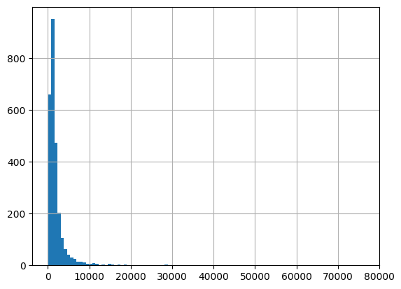

# Old Bailey Verdict Prediction Model
Welcome! In short, I wanted to try my luck at a guilt predictor. I liked the quality/format of this dataset, and appreciate its oldness when coming around to guilt. If you have some time checkout some of the cases, they get pretty crazy! I finetuned a huggingface model in colab, so feel free to checkout what I did. Be warned that this may take your device an uncomfortably long time to run. Thanks!

## Usage:
- throw this ipynb into colab and it should be good to run
- here is the old bailey website but I used some precleaned stuff from another prof's class repo: https://www.oldbaileyonline.org/about/verdicts


(Source: https://www.oldbaileyonline.org/about/verdicts)

## Report:
#### Section 1: The Purpose of my Task
To formally define this new purpose: I want to finetune a huggingface provided LLM
with historical case briefs from the old Bailey, so by feeding in an anonymized case brief,
the model would return a verdict either ‘GUILTY’ or ‘NOT GUILTY’. For now, this model is
limited in experience to 300 years of British 20th century verdicts, however positive results
could yield a judging assistant acting as a double jury, or even mediating arguments over
text mediums like discord or groupMe.
The idea of an unbiased AI judge is both appealing and concerning. Morally, ever
relying on these models would be a big scare, however I think that the overall idea of
applying ‘human’ tasks to LLM’s is an interesting way to see the bounds that next token
prediction can produce. For the example of this task, I’m really only concerned with one
prediction/generation, where I hope that the finetuning trains the model to utilize its
context to find commonalities of these guilty verdicts. I took a 20 sample test on these
verdicts and scored 75%, and hope to get the model to consistently outperform my score. I
put these questions at the bottom of the colab notebook if you want to try it out for yourself.
While I could perform better just by picking the majority class, (imbalanced towards
GUILTY), there were noticeable patterns. For example, the prosecutor not showing up was
indicative of a NOT GUILTY verdict.

#### Section 2: Decisions and Challenges I Encountered During Training
My first major challenge was finding a setup that didn’t overuse all of the gpu
memory in colab. Last time when we finetuned, the GPU drove all of the performance for
5
our better loss models, however with the large number of rows and high text length of the
case briefs, I had to selectively scale down certain areas of this project. I first set an
arbitrary cutoff to the text length. This adjustment lowered row and token count, which
translates to fewer matrix multiplications and a smaller context window. The next iteration
of downscaling came from lowering the model size, and training arguments. I switched to
the pythia 410m model (from 1b). I feel that downweighing the model size was worth the
tradeoff in complexity that additional layers and attention heads would yield for an
increase in training speed. With greedier parameters runtimes would take upwards of an
hour, which limited my ability to tune small adjustments. I felt that it brought more value
to the project, given an understanding that much of the brief to brief similarity could be
captured strictly with word counts. I noticed that the outputs were often giving unrelated or
nonsense tokens. To remedy this issue, I lowered model size again to the 70m parameter
model, and increased the threshold for evidence length allowed in the finetuning dataset. I
also set do_sample = false in my generation parameters. Between these two changes. The
model would have higher specialization on the data, and at the same time being less
encouraged to look for tokens outside of the provided data.
#### Section 3: A Discussion of how I Evaluated my Results
As discussed in Section 0, I designed the revision to have measurable performance in
terms of output, meaning my analysis didn’t have to strictly rely on loss metrics, which
were harder to interpret in context. I iterated through the outputs, extracted guilt, created
an array y_pred, and created an array of gold labels from the original dataset y_true. This
allowed me to run a classification report in addition to the cross entropy loss. The
6
Above: The above reports show accuracy measures for first the model, second random
choice, and third selecting the majority class. (left) The 70m and (right) 410m pythia models
both performed worse than the majority classifier, but higher f1 over random assignment
shows indication of weight changes favoring ‘GUILTY’ labels.
classification reports allowed a direct measure of correctness, which often showed a
different story than the loss metrics. Further evidence of meaningful change to the base
model’s weights was found when I looked at the cross entropy loss. Because the data we
split into a train-test split, the significantly higher training loss (~54 for both models) was
contextualized by evaluation loss of 1.94 and 1.98 (below results from the anti-trust model),
showing that the low compute available was likely holding back the optimal amount of
training time, however, the model’s output still minimized loss on unseen data. This also
served as another indicator that adding additional finetuning data was the right call, as the
minimal rows with very low training loss could have resulted in overfitting in Group Work
4/. These earlier results helped to contextualize the values for this problem, and from there I
moved up to a larger gpu and model (410m), with lower learning rate and a doubled batch
size. These changes were aimed at getting more stable gradient descent, and with weight
changes leveraging more datapoints and tuning less aggressively, I hoped to overshoot
fewer minima. This proved to be the case, as this final model had half the training loss at
~24, but performed the worst of all models at guessing guilt from the real data with f1
below 0.4 in both GUILTY and NOT
GUILTY. On the other hand I ran the 1b
model (right) , got 78 training loss, and
outperformed the majority class’s
weighted average by 0.11!
With training and tuning
parameters, the model’s performance on
this guilt identifying task didn’t meet
human standards, at the cost of leaving
high-risk criminals to a hugging face
model. Why didn’t it work? I think that
the first glaring issue is the constraints to
how much information the model could
process at a time. It's hard to say if
additional training would improve the
classification, given that the worst f1
came from the best training loss. One
possibility is that shorter cases tended to
be NOT GUILTY, which could mean that
after a certain point the training data
improved loss by guessing the majority,
and when the majority flipped in the
7
evaluation, it was reflected in the f1. This leads me to suggest more training, but in any
business setting I feel like throwing money at a so far worthless model is a bad idea. That
being said, notable improvement was made just by using a larger model. This supports the
pseudo-optimistic possibility that this sort of binary classification is only sufficient given
real intelligence in a court environment influenced by tone, argument, and reactions, and
interplay between numerous elements overall. I have a hard time believing that a model
couldn’t find optimal weights given enough data, but even if it did work with 90% accuracy
I doubt it would be accepted. I think part of the court process is in a group of people holding
onto blame for their verdict. The context of a peer judgement holds true even formally, and
the ability to feel the weight of the decision gives a sense of legitimacy that judgements
echo people’s sentiment.

## Code:

```python
import torch
torch.cuda.empty_cache()
```


```python
from google.colab import drive

drive.mount('/content/drive')
```

    Mounted at /content/drive


```python
!pip install datasets -q
!pip install --upgrade sympy -q
from transformers import AutoTokenizer, AutoModelForCausalLM, TrainingArguments, Trainer, DataCollatorForLanguageModeling
from datasets import Dataset
import pandas as pd
import requests
import os
import numpy as np
from sklearn.metrics import classification_report
from tqdm.notebook import tqdm
os.environ["PYTORCH_CUDA_ALLOC_CONF"] = "expandable_segments:True"
```

    [?25l   ━━━━━━━━━━━━━━━━━━━━━━━━━━━━━━━━━━━━━━━━ 0.0/480.6 kB ? eta -:--:--
   ━━━━━━━━━━━━━━━━━━━━━━━━━━━━━━━━━━━━━━━╺ 471.0/480.6 kB 14.1 MB/s eta 0:00:01
   ━━━━━━━━━━━━━━━━━━━━━━━━━━━━━━━━━━━━━━━━ 480.6/480.6 kB 10.4 MB/s eta 0:00:00
    [?25h[?25l   ━━━━━━━━━━━━━━━━━━━━━━━━━━━━━━━━━━━━━━━━ 0.0/116.3 kB ? eta -:--:--
   ━━━━━━━━━━━━━━━━━━━━━━━━━━━━━━━━━━━━━━━━ 116.3/116.3 kB 12.1 MB/s eta 0:00:00
    [?25h[?25l   ━━━━━━━━━━━━━━━━━━━━━━━━━━━━━━━━━━━━━━━━ 0.0/179.3 kB ? eta -:--:--
   ━━━━━━━━━━━━━━━━━━━━━━━━━━━━━━━━━━━━━━━━ 179.3/179.3 kB 16.8 MB/s eta 0:00:00
       ━━━━━━━━━━━━━━━━━━━━━━━━━━━━━━━━━━━━━━━━ 134.8/134.8 kB 13.5 MB/s eta 0:00:00
       ━━━━━━━━━━━━━━━━━━━━━━━━━━━━━━━━━━━━━━━━ 194.1/194.1 kB 18.4 MB/s eta 0:00:00
    [?25hERROR: pip's dependency resolver does not currently take into account all the packages that are installed. This behaviour is the source of the following dependency conflicts.
    gcsfs 2024.10.0 requires fsspec==2024.10.0, but you have fsspec 2024.9.0 which is incompatible.
       ━━━━━━━━━━━━━━━━━━━━━━━━━━━━━━━━━━━━━━━━ 6.2/6.2 MB 52.6 MB/s eta 0:00:00
    [?25hERROR: pip's dependency resolver does not currently take into account all the packages that are installed. This behaviour is the source of the following dependency conflicts.
    torch 2.5.1+cu121 requires sympy==1.13.1; python_version >= "3.9", but you have sympy 1.13.3 which is incompatible.
    


```python
#parameters
device = torch.device("cuda")
max_length = 2500 #context window size
model_name = "EleutherAI/pythia-410m" #model used as base
```

#Loading and Cleaning Old Bailey Data


```python

url = "https://raw.githubusercontent.com/wilkens-teaching/info3350-f24/main/data/old_bailey/old_bailey.txt"
old_bailey_data = requests.get(url).text

# Split on consecutive newlines to create bailey
bailey = [doc for doc in old_bailey_data.split('\n\n')]
bailey_df = pd.DataFrame({'full_text': bailey, 'verdict': ''})

for index, row in bailey_df.iterrows():
  if " NOT GUILTY ." in row['full_text']:
    bailey_df.loc[index, 'verdict'] = 'NOT GUILTY'
    bailey_df.loc[index, 'evidence'] = row['full_text'][:row['full_text'].rfind(' NOT GUILTY .')]
  elif " GUILTY ." in row['full_text'] and " NOT GUILTY ." not in row['full_text']:
    bailey_df.loc[index, 'verdict'] = 'GUILTY'
    bailey_df.loc[index, 'evidence'] = row['full_text'][:row['full_text'].rfind(' GUILTY .')]
# if " not guilty ." in row['full_text'].lower()
# elif " guilty ." in row['full_text'].lower() and " not guilty ." not in row['full_text'].lower():

print(f"Total number of documents: {len(bailey_df)}")
print(f"Number of guilty verdicts: {len(bailey_df[bailey_df['verdict'] == 'GUILTY'])}")
print(f"Number of not guilty verdicts: {len(bailey_df[bailey_df['verdict'] == 'NOT GUILTY'])}")
print(f"Max word count of the evidence column: {bailey_df['evidence'].str.split().str.len().max()}")

bailey_df['evidence_length'] = bailey_df['evidence'].str.len() / 4
bailey_df['evidence'].str.len().hist(bins=100)
bailey_df['valid'] = bailey_df['evidence_length'].apply(lambda x: 1 if x < max_length*0.75 else 0)
print(f"Number of valid rows: {bailey_df[bailey_df['valid'] == 1].shape[0]}")
bailey_df.head(10)
```

    Total number of documents: 3090
    Number of guilty verdicts: 1910
    Number of not guilty verdicts: 753
    Max word count of the evidence column: 14805.0
    Number of valid rows: 2566


  <div id="df-e85fe012-5ad9-4518-a1ca-2154390eddcf" class="colab-df-container">
    <div>
<style scoped>
    .dataframe tbody tr th:only-of-type {
        vertical-align: middle;
    }

    .dataframe tbody tr th {
        vertical-align: top;
    }

    .dataframe thead th {
        text-align: right;
    }
</style>
<table border="1" class="dataframe">
  <thead>
    <tr style="text-align: right;">
      <th></th>
      <th>full_text</th>
      <th>verdict</th>
      <th>evidence</th>
      <th>evidence_length</th>
      <th>valid</th>
    </tr>
  </thead>
  <tbody>
    <tr>
      <th>0</th>
      <td>was indicted for feloniously breaking and ente...</td>
      <td>GUILTY</td>
      <td>was indicted for feloniously breaking and ente...</td>
      <td>76.00</td>
      <td>1</td>
    </tr>
    <tr>
      <th>1</th>
      <td>was indicted for stealing, on the 7th of May ,...</td>
      <td>GUILTY</td>
      <td>was indicted for stealing, on the 7th of May ,...</td>
      <td>401.25</td>
      <td>1</td>
    </tr>
    <tr>
      <th>2</th>
      <td>was indicted for burglariously breaking and en...</td>
      <td>GUILTY</td>
      <td>was indicted for burglariously breaking and en...</td>
      <td>867.50</td>
      <td>1</td>
    </tr>
    <tr>
      <th>3</th>
      <td>was indicted for feloniously assaulting , on t...</td>
      <td>GUILTY</td>
      <td>was indicted for feloniously assaulting , on t...</td>
      <td>680.50</td>
      <td>1</td>
    </tr>
    <tr>
      <th>4</th>
      <td>was indicted for stealing, on the 9th of Decem...</td>
      <td></td>
      <td>NaN</td>
      <td>NaN</td>
      <td>0</td>
    </tr>
    <tr>
      <th>5</th>
      <td>was indicted for feloniously assaulting , on t...</td>
      <td>GUILTY</td>
      <td>was indicted for feloniously assaulting , on t...</td>
      <td>505.50</td>
      <td>1</td>
    </tr>
    <tr>
      <th>6</th>
      <td>was indicted for stealing, on the 14th of Dece...</td>
      <td></td>
      <td>NaN</td>
      <td>NaN</td>
      <td>0</td>
    </tr>
    <tr>
      <th>7</th>
      <td>was indicted for stealing, on the 5th of Janua...</td>
      <td></td>
      <td>NaN</td>
      <td>NaN</td>
      <td>0</td>
    </tr>
    <tr>
      <th>8</th>
      <td>and were indicted for stealing, on the 31st of...</td>
      <td>GUILTY</td>
      <td>and were indicted for stealing, on the 31st of...</td>
      <td>340.00</td>
      <td>1</td>
    </tr>
    <tr>
      <th>9</th>
      <td>and were indicted for stealing, on the 5th of ...</td>
      <td>NOT GUILTY</td>
      <td>and were indicted for stealing, on the 5th of ...</td>
      <td>1024.75</td>
      <td>1</td>
    </tr>
  </tbody>
</table>
</div>
    <div class="colab-df-buttons">

  <div class="colab-df-container">
    <button class="colab-df-convert" onclick="convertToInteractive('df-e85fe012-5ad9-4518-a1ca-2154390eddcf')"
            title="Convert this dataframe to an interactive table."
            style="display:none;">

  <svg xmlns="http://www.w3.org/2000/svg" height="24px" viewBox="0 -960 960 960">
    <path d="M120-120v-720h720v720H120Zm60-500h600v-160H180v160Zm220 220h160v-160H400v160Zm0 220h160v-160H400v160ZM180-400h160v-160H180v160Zm440 0h160v-160H620v160ZM180-180h160v-160H180v160Zm440 0h160v-160H620v160Z"/>
  </svg>
    </button>

  <style>
    .colab-df-container {
      display:flex;
      gap: 12px;
    }

    .colab-df-convert {
      background-color: #E8F0FE;
      border: none;
      border-radius: 50%;
      cursor: pointer;
      display: none;
      fill: #1967D2;
      height: 32px;
      padding: 0 0 0 0;
      width: 32px;
    }

    .colab-df-convert:hover {
      background-color: #E2EBFA;
      box-shadow: 0px 1px 2px rgba(60, 64, 67, 0.3), 0px 1px 3px 1px rgba(60, 64, 67, 0.15);
      fill: #174EA6;
    }

    .colab-df-buttons div {
      margin-bottom: 4px;
    }

    [theme=dark] .colab-df-convert {
      background-color: #3B4455;
      fill: #D2E3FC;
    }

    [theme=dark] .colab-df-convert:hover {
      background-color: #434B5C;
      box-shadow: 0px 1px 3px 1px rgba(0, 0, 0, 0.15);
      filter: drop-shadow(0px 1px 2px rgba(0, 0, 0, 0.3));
      fill: #FFFFFF;
    }
  </style>

    <script>
      const buttonEl =
        document.querySelector('#df-e85fe012-5ad9-4518-a1ca-2154390eddcf button.colab-df-convert');
      buttonEl.style.display =
        google.colab.kernel.accessAllowed ? 'block' : 'none';

      async function convertToInteractive(key) {
        const element = document.querySelector('#df-e85fe012-5ad9-4518-a1ca-2154390eddcf');
        const dataTable =
          await google.colab.kernel.invokeFunction('convertToInteractive',
                                                    [key], {});
        if (!dataTable) return;

        const docLinkHtml = 'Like what you see? Visit the ' +
          '<a target="_blank" href=https://colab.research.google.com/notebooks/data_table.ipynb>data table notebook</a>'
          + ' to learn more about interactive tables.';
        element.innerHTML = '';
        dataTable['output_type'] = 'display_data';
        await google.colab.output.renderOutput(dataTable, element);
        const docLink = document.createElement('div');
        docLink.innerHTML = docLinkHtml;
        element.appendChild(docLink);
      }
    </script>
  </div>


<div id="df-90350b8d-b8f5-4b6c-8831-5d9c1380cd3a">
  <button class="colab-df-quickchart" onclick="quickchart('df-90350b8d-b8f5-4b6c-8831-5d9c1380cd3a')"
            title="Suggest charts"
            style="display:none;">

<svg xmlns="http://www.w3.org/2000/svg" height="24px"viewBox="0 0 24 24"
     width="24px">
    <g>
        <path d="M19 3H5c-1.1 0-2 .9-2 2v14c0 1.1.9 2 2 2h14c1.1 0 2-.9 2-2V5c0-1.1-.9-2-2-2zM9 17H7v-7h2v7zm4 0h-2V7h2v10zm4 0h-2v-4h2v4z"/>
    </g>
</svg>
  </button>

<style>
  .colab-df-quickchart {
      --bg-color: #E8F0FE;
      --fill-color: #1967D2;
      --hover-bg-color: #E2EBFA;
      --hover-fill-color: #174EA6;
      --disabled-fill-color: #AAA;
      --disabled-bg-color: #DDD;
  }

  [theme=dark] .colab-df-quickchart {
      --bg-color: #3B4455;
      --fill-color: #D2E3FC;
      --hover-bg-color: #434B5C;
      --hover-fill-color: #FFFFFF;
      --disabled-bg-color: #3B4455;
      --disabled-fill-color: #666;
  }

  .colab-df-quickchart {
    background-color: var(--bg-color);
    border: none;
    border-radius: 50%;
    cursor: pointer;
    display: none;
    fill: var(--fill-color);
    height: 32px;
    padding: 0;
    width: 32px;
  }

  .colab-df-quickchart:hover {
    background-color: var(--hover-bg-color);
    box-shadow: 0 1px 2px rgba(60, 64, 67, 0.3), 0 1px 3px 1px rgba(60, 64, 67, 0.15);
    fill: var(--button-hover-fill-color);
  }

  .colab-df-quickchart-complete:disabled,
  .colab-df-quickchart-complete:disabled:hover {
    background-color: var(--disabled-bg-color);
    fill: var(--disabled-fill-color);
    box-shadow: none;
  }

  .colab-df-spinner {
    border: 2px solid var(--fill-color);
    border-color: transparent;
    border-bottom-color: var(--fill-color);
    animation:
      spin 1s steps(1) infinite;
  }

  @keyframes spin {
    0% {
      border-color: transparent;
      border-bottom-color: var(--fill-color);
      border-left-color: var(--fill-color);
    }
    20% {
      border-color: transparent;
      border-left-color: var(--fill-color);
      border-top-color: var(--fill-color);
    }
    30% {
      border-color: transparent;
      border-left-color: var(--fill-color);
      border-top-color: var(--fill-color);
      border-right-color: var(--fill-color);
    }
    40% {
      border-color: transparent;
      border-right-color: var(--fill-color);
      border-top-color: var(--fill-color);
    }
    60% {
      border-color: transparent;
      border-right-color: var(--fill-color);
    }
    80% {
      border-color: transparent;
      border-right-color: var(--fill-color);
      border-bottom-color: var(--fill-color);
    }
    90% {
      border-color: transparent;
      border-bottom-color: var(--fill-color);
    }
  }
</style>

  <script>
    async function quickchart(key) {
      const quickchartButtonEl =
        document.querySelector('#' + key + ' button');
      quickchartButtonEl.disabled = true;  // To prevent multiple clicks.
      quickchartButtonEl.classList.add('colab-df-spinner');
      try {
        const charts = await google.colab.kernel.invokeFunction(
            'suggestCharts', [key], {});
      } catch (error) {
        console.error('Error during call to suggestCharts:', error);
      }
      quickchartButtonEl.classList.remove('colab-df-spinner');
      quickchartButtonEl.classList.add('colab-df-quickchart-complete');
    }
    (() => {
      let quickchartButtonEl =
        document.querySelector('#df-90350b8d-b8f5-4b6c-8831-5d9c1380cd3a button');
      quickchartButtonEl.style.display =
        google.colab.kernel.accessAllowed ? 'block' : 'none';
    })();
  </script>
</div>

    </div>
  </div>


    

    


#Fine Tuning


```python
model_name = model_name

tokenizer = AutoTokenizer.from_pretrained(model_name)
tokenizer.pad_token = tokenizer.eos_token
# Move model to device
model = AutoModelForCausalLM.from_pretrained(model_name).to(device)

if model.config.pad_token_id is None:
    model.config.pad_token_id = tokenizer.eos_token_id
```

    /usr/local/lib/python3.10/dist-packages/huggingface_hub/utils/_auth.py:94: UserWarning: 
    The secret `HF_TOKEN` does not exist in your Colab secrets.
    To authenticate with the Hugging Face Hub, create a token in your settings tab (https://huggingface.co/settings/tokens), set it as secret in your Google Colab and restart your session.
    You will be able to reuse this secret in all of your notebooks.
    Please note that authentication is recommended but still optional to access public models or datasets.
      warnings.warn(


    tokenizer_config.json:   0%|          | 0.00/396 [00:00<?, ?B/s]


    tokenizer.json:   0%|          | 0.00/2.11M [00:00<?, ?B/s]


    special_tokens_map.json:   0%|          | 0.00/99.0 [00:00<?, ?B/s]


    config.json:   0%|          | 0.00/570 [00:00<?, ?B/s]


    model.safetensors:   0%|          | 0.00/911M [00:00<?, ?B/s]


    The `GPTNeoXSdpaAttention` class is deprecated in favor of simply modifying the `config._attn_implementation`attribute of the `GPTNeoXAttention` class! It will be removed in v4.48


```python
def prepare_dataset(questions, answers):
    return Dataset.from_dict({"text": [f"Arguement: {q}\nVerdict: {a}" for q, a in zip(questions, answers)]})

def tokenize_function(examples, tokenizer, max_length):
    return tokenizer(examples["text"], truncation=True, padding="max_length", max_length=max_length)

questions_df = bailey_df[bailey_df["valid"] == 1]
dataset = prepare_dataset(questions_df["evidence"], questions_df["verdict"])
```


```python
dataset
```


    Dataset({
        features: ['text'],
        num_rows: 2566
    })


```python
# Set up data collator
data_collator = DataCollatorForLanguageModeling(tokenizer=tokenizer, mlm=False)

# Preprocess the dataset
max_length = max_length
tokenized_dataset = dataset.map(
    lambda examples: tokenize_function(examples, tokenizer, max_length),
    batched=True,
    remove_columns=dataset.column_names
)
```


    Map:   0%|          | 0/2566 [00:00<?, ? examples/s]


```python
train_test = tokenized_dataset.train_test_split(test_size=0.1)
```


```python
train_test
```


    DatasetDict({
        train: Dataset({
            features: ['input_ids', 'attention_mask'],
            num_rows: 2309
        })
        test: Dataset({
            features: ['input_ids', 'attention_mask'],
            num_rows: 257
        })
    })


```python
dataset[0], tokenized_dataset[0]
```


    ({'text': "Arguement: was indicted for feloniously breaking and entering the dwelling-house of and , about three o'clock in the afternoon of the 4th of January , at St. James, Westminster ( and others being therein), and stealing, one coat, value 18 s., and one sheet, value 2 s., the goods of the said . The prisoner pleaded,\nVerdict: GUILTY"},
     {'input_ids': [2906,
       4297,
       1003,
       27,
       369,
       38455,
       323,
       48935,
       8140,
       10155,
       285,
       11734,
       253,
       31824,
       14,
       5967,
       273,
       285,
       1157,
       670,
       1264,
       258,
       8,
       13273,
       275,
       253,
       9055,
       273,
       253,
       577,
       394,
       273,
       4247,
       1157,
       387,
       659,
       15,
       5490,
       13,
       34328,
       313,
       285,
       2571,
       1146,
       15308,
       582,
       285,
       27980,
       13,
       581,
       11959,
       13,
       1318,
       1283,
       256,
       904,
       285,
       581,
       8335,
       13,
       1318,
       374,
       256,
       904,
       253,
       10229,
       273,
       253,
       753,
       964,
       380,
       18897,
       23383,
       13,
       187,
       10754,
       8102,
       27,
       31844,
       3077,
       25090,
       0,
       0,
       0,
       0,
       0,
       0,
       0,
       0,
       0,
       0,
       0,
       0,
       0,
       0,
       0,
       0,
       0,
       0,
       0,
       0,
       0,
       0,
       0,
       0,
       0,
       0,
       0,
       0,
       0,
       0,
       0,
       0,
       0,
       0,
       0,
       0,
       0,
       0,
       0,
       0,
       0,
       0,
       0,
       0,
       0,
       0,
       0,
       0,
       0,
       0,
       0,
       0,
       0,
       0,
       0,
       0,
       0,
       0,
       0,
       0,
       0,
       0,
       0,
       0,
       0,
       0,
       0,
       0,
       0,
       0,
       0,
       0,
       0,
       0,
       0,
       0,
       0,
       0,
       0,
       0,
       0,
       0,
       0,
       0,
       0,
       0,
       0,
       0,
       0,
       0,
       0,
       0,
       0,
       0,
       0,
       0,
       0,
       0,
       0,
       0,
       0,
       0,
       0,
       0,
       0,
       0,
       0,
       0,
       0,
       0,
       0,
       0,
       0,
       0,
       0,
       0,
       0,
       0,
       0,
       0,
       0,
       0,
       0,
       0,
       0,
       0,
       0,
       0,
       0,
       0,
       0,
       0,
       0,
       0,
       0,
       0,
       0,
       0,
       0,
       0,
       0,
       0,
       0,
       0,
       0,
       0,
       0,
       0,
       0,
       0,
       0,
       0,
       0,
       0,
       0,
       0,
       0,
       0,
       0,
       0,
       0,
       0,
       0,
       0,
       0,
       0,
       0,
       0,
       0,
       0,
       0,
       0,
       0,
       0,
       0,
       0,
       0,
       0,
       0,
       0,
       0,
       0,
       0,
       0,
       0,
       0,
       0,
       0,
       0,
       0,
       0,
       0,
       0,
       0,
       0,
       0,
       0,
       0,
       0,
       0,
       0,
       0,
       0,
       0,
       0,
       0,
       0,
       0,
       0,
       0,
       0,
       0,
       0,
       0,
       0,
       0,
       0,
       0,
       0,
       0,
       0,
       0,
       0,
       0,
       0,
       0,
       0,
       0,
       0,
       0,
       0,
       0,
       0,
       0,
       0,
       0,
       0,
       0,
       0,
       0,
       0,
       0,
       0,
       0,
       0,
       0,
       0,
       0,
       0,
       0,
       0,
       0,
       0,
       0,
       0,
       0,
       0,
       0,
       0,
       0,
       0,
       0,
       0,
       0,
       0,
       0,
       0,
       0,
       0,
       0,
       0,
       0,
       0,
       0,
       0,
       0,
       0,
       0,
       0,
       0,
       0,
       0,
       0,
       0,
       0,
       0,
       0,
       0,
       0,
       0,
       0,
       0,
       0,
       0,
       0,
       0,
       0,
       0,
       0,
       0,
       0,
       0,
       0,
       0,
       0,
       0,
       0,
       0,
       0,
       0,
       0,
       0,
       0,
       0,
       0,
       0,
       0,
       0,
       0,
       0,
       0,
       0,
       0,
       0,
       0,
       0,
       0,
       0,
       0,
       0,
       0,
       0,
       0,
       0,
       0,
       0,
       0,
       0,
       0,
       0,
       0,
       0,
       0,
       0,
       0,
       0,
       0,
       0,
       0,
       0,
       0,
       0,
       0,
       0,
       0,
       0,
       0,
       0,
       0,
       0,
       0,
       0,
       0,
       0,
       0,
       0,
       0,
       0,
       0,
       0,
       0,
       0,
       0,
       0,
       0,
       0,
       0,
       0,
       0,
       0,
       0,
       0,
       0,
       0,
       0,
       0,
       0,
       0,
       0,
       0,
       0,
       0,
       0,
       0,
       0,
       0,
       0,
       0,
       0,
       0,
       0,
       0,
       0,
       0,
       0,
       0,
       0,
       0,
       0,
       0,
       0,
       0,
       0,
       0,
       0,
       0,
       0,
       0,
       0,
       0,
       0,
       0,
       0,
       0,
       0,
       0,
       0,
       0,
       0,
       0,
       0,
       0,
       0,
       0,
       0,
       0,
       0,
       0,
       0,
       0,
       0,
       0,
       0,
       0,
       0,
       0,
       0,
       0,
       0,
       0,
       0,
       0,
       0,
       0,
       0,
       0,
       0,
       0,
       0,
       0,
       0,
       0,
       0,
       0,
       0,
       0,
       0,
       0,
       0,
       0,
       0,
       0,
       0,
       0,
       0,
       0,
       0,
       0,
       0,
       0,
       0,
       0,
       0,
       0,
       0,
       0,
       0,
       0,
       0,
       0,
       0,
       0,
       0,
       0,
       0,
       0,
       0,
       0,
       0,
       0,
       0,
       0,
       0,
       0,
       0,
       0,
       0,
       0,
       0,
       0,
       0,
       0,
       0,
       0,
       0,
       0,
       0,
       0,
       0,
       0,
       0,
       0,
       0,
       0,
       0,
       0,
       0,
       0,
       0,
       0,
       0,
       0,
       0,
       0,
       0,
       0,
       0,
       0,
       0,
       0,
       0,
       0,
       0,
       0,
       0,
       0,
       0,
       0,
       0,
       0,
       0,
       0,
       0,
       0,
       0,
       0,
       0,
       0,
       0,
       0,
       0,
       0,
       0,
       0,
       0,
       0,
       0,
       0,
       0,
       0,
       0,
       0,
       0,
       0,
       0,
       0,
       0,
       0,
       0,
       0,
       0,
       0,
       0,
       0,
       0,
       0,
       0,
       0,
       0,
       0,
       0,
       0,
       0,
       0,
       0,
       0,
       0,
       0,
       0,
       0,
       0,
       0,
       0,
       0,
       0,
       0,
       0,
       0,
       0,
       0,
       0,
       0,
       0,
       0,
       0,
       0,
       0,
       0,
       0,
       0,
       0,
       0,
       0,
       0,
       0,
       0,
       0,
       0,
       0,
       0,
       0,
       0,
       0,
       0,
       0,
       0,
       0,
       0,
       0,
       0,
       0,
       0,
       0,
       0,
       0,
       0,
       0,
       0,
       0,
       0,
       0,
       0,
       0,
       0,
       0,
       0,
       0,
       0,
       0,
       0,
       0,
       0,
       0,
       0,
       0,
       0,
       0,
       0,
       0,
       0,
       0,
       0,
       0,
       0,
       0,
       0,
       0,
       0,
       0,
       0,
       0,
       0,
       0,
       0,
       0,
       0,
       0,
       0,
       0,
       0,
       0,
       0,
       0,
       0,
       0,
       0,
       0,
       0,
       0,
       0,
       0,
       0,
       0,
       0,
       0,
       0,
       0,
       0,
       0,
       0,
       0,
       0,
       0,
       0,
       0,
       0,
       0,
       0,
       0,
       0,
       0,
       0,
       0,
       0,
       0,
       0,
       0,
       0,
       0,
       0,
       0,
       0,
       0,
       0,
       0,
       0,
       0,
       0,
       0,
       0,
       0,
       0,
       0,
       0,
       0,
       0,
       0,
       0,
       0,
       0,
       0,
       0,
       0,
       0,
       0,
       0,
       0,
       0,
       0,
       0,
       0,
       0,
       0,
       0,
       0,
       0,
       0,
       0,
       0,
       0,
       0,
       0,
       0,
       0,
       0,
       0,
       0,
       0,
       0,
       0,
       0,
       0,
       0,
       0,
       0,
       0,
       0,
       0,
       0,
       0,
       0,
       0,
       0,
       0,
       0,
       0,
       0,
       0,
       0,
       0,
       0,
       0,
       0,
       0,
       0,
       0,
       0,
       0,
       0,
       0,
       0,
       0,
       0,
       0,
       0,
       0,
       0,
       0,
       0,
       0,
       0,
       0,
       0,
       0,
       0,
       0,
       0,
       0,
       0,
       0,
       0,
       0,
       0,
       0,
       0,
       0,
       0,
       0,
       0,
       0,
       0,
       0,
       0,
       0,
       0,
       0,
       0,
       0,
       0,
       0,
       0,
       0,
       0,
       0,
       0,
       0,
       0,
       0,
       0,
       0,
       0,
       0,
       0,
       0,
       0,
       0,
       0,
       0,
       0,
       0,
       0,
       0,
       0,
       0,
       0,
       0,
       0,
       0,
       0,
       0,
       0,
       0,
       0,
       0,
       0,
       0,
       0,
       0,
       0,
       0,
       0,
       0,
       0,
       0,
       0,
       0,
       0,
       0,
       0,
       0,
       0,
       0,
       0,
       0,
       0,
       0,
       0,
       0,
       0,
       0,
       0,
       0,
       0,
       0,
       0,
       0,
       0,
       0,
       0,
       ...],
      'attention_mask': [1,
       1,
       1,
       1,
       1,
       1,
       1,
       1,
       1,
       1,
       1,
       1,
       1,
       1,
       1,
       1,
       1,
       1,
       1,
       1,
       1,
       1,
       1,
       1,
       1,
       1,
       1,
       1,
       1,
       1,
       1,
       1,
       1,
       1,
       1,
       1,
       1,
       1,
       1,
       1,
       1,
       1,
       1,
       1,
       1,
       1,
       1,
       1,
       1,
       1,
       1,
       1,
       1,
       1,
       1,
       1,
       1,
       1,
       1,
       1,
       1,
       1,
       1,
       1,
       1,
       1,
       1,
       1,
       1,
       1,
       1,
       1,
       1,
       1,
       1,
       1,
       1,
       1,
       1,
       1,
       1,
       0,
       0,
       0,
       0,
       0,
       0,
       0,
       0,
       0,
       0,
       0,
       0,
       0,
       0,
       0,
       0,
       0,
       0,
       0,
       0,
       0,
       0,
       0,
       0,
       0,
       0,
       0,
       0,
       0,
       0,
       0,
       0,
       0,
       0,
       0,
       0,
       0,
       0,
       0,
       0,
       0,
       0,
       0,
       0,
       0,
       0,
       0,
       0,
       0,
       0,
       0,
       0,
       0,
       0,
       0,
       0,
       0,
       0,
       0,
       0,
       0,
       0,
       0,
       0,
       0,
       0,
       0,
       0,
       0,
       0,
       0,
       0,
       0,
       0,
       0,
       0,
       0,
       0,
       0,
       0,
       0,
       0,
       0,
       0,
       0,
       0,
       0,
       0,
       0,
       0,
       0,
       0,
       0,
       0,
       0,
       0,
       0,
       0,
       0,
       0,
       0,
       0,
       0,
       0,
       0,
       0,
       0,
       0,
       0,
       0,
       0,
       0,
       0,
       0,
       0,
       0,
       0,
       0,
       0,
       0,
       0,
       0,
       0,
       0,
       0,
       0,
       0,
       0,
       0,
       0,
       0,
       0,
       0,
       0,
       0,
       0,
       0,
       0,
       0,
       0,
       0,
       0,
       0,
       0,
       0,
       0,
       0,
       0,
       0,
       0,
       0,
       0,
       0,
       0,
       0,
       0,
       0,
       0,
       0,
       0,
       0,
       0,
       0,
       0,
       0,
       0,
       0,
       0,
       0,
       0,
       0,
       0,
       0,
       0,
       0,
       0,
       0,
       0,
       0,
       0,
       0,
       0,
       0,
       0,
       0,
       0,
       0,
       0,
       0,
       0,
       0,
       0,
       0,
       0,
       0,
       0,
       0,
       0,
       0,
       0,
       0,
       0,
       0,
       0,
       0,
       0,
       0,
       0,
       0,
       0,
       0,
       0,
       0,
       0,
       0,
       0,
       0,
       0,
       0,
       0,
       0,
       0,
       0,
       0,
       0,
       0,
       0,
       0,
       0,
       0,
       0,
       0,
       0,
       0,
       0,
       0,
       0,
       0,
       0,
       0,
       0,
       0,
       0,
       0,
       0,
       0,
       0,
       0,
       0,
       0,
       0,
       0,
       0,
       0,
       0,
       0,
       0,
       0,
       0,
       0,
       0,
       0,
       0,
       0,
       0,
       0,
       0,
       0,
       0,
       0,
       0,
       0,
       0,
       0,
       0,
       0,
       0,
       0,
       0,
       0,
       0,
       0,
       0,
       0,
       0,
       0,
       0,
       0,
       0,
       0,
       0,
       0,
       0,
       0,
       0,
       0,
       0,
       0,
       0,
       0,
       0,
       0,
       0,
       0,
       0,
       0,
       0,
       0,
       0,
       0,
       0,
       0,
       0,
       0,
       0,
       0,
       0,
       0,
       0,
       0,
       0,
       0,
       0,
       0,
       0,
       0,
       0,
       0,
       0,
       0,
       0,
       0,
       0,
       0,
       0,
       0,
       0,
       0,
       0,
       0,
       0,
       0,
       0,
       0,
       0,
       0,
       0,
       0,
       0,
       0,
       0,
       0,
       0,
       0,
       0,
       0,
       0,
       0,
       0,
       0,
       0,
       0,
       0,
       0,
       0,
       0,
       0,
       0,
       0,
       0,
       0,
       0,
       0,
       0,
       0,
       0,
       0,
       0,
       0,
       0,
       0,
       0,
       0,
       0,
       0,
       0,
       0,
       0,
       0,
       0,
       0,
       0,
       0,
       0,
       0,
       0,
       0,
       0,
       0,
       0,
       0,
       0,
       0,
       0,
       0,
       0,
       0,
       0,
       0,
       0,
       0,
       0,
       0,
       0,
       0,
       0,
       0,
       0,
       0,
       0,
       0,
       0,
       0,
       0,
       0,
       0,
       0,
       0,
       0,
       0,
       0,
       0,
       0,
       0,
       0,
       0,
       0,
       0,
       0,
       0,
       0,
       0,
       0,
       0,
       0,
       0,
       0,
       0,
       0,
       0,
       0,
       0,
       0,
       0,
       0,
       0,
       0,
       0,
       0,
       0,
       0,
       0,
       0,
       0,
       0,
       0,
       0,
       0,
       0,
       0,
       0,
       0,
       0,
       0,
       0,
       0,
       0,
       0,
       0,
       0,
       0,
       0,
       0,
       0,
       0,
       0,
       0,
       0,
       0,
       0,
       0,
       0,
       0,
       0,
       0,
       0,
       0,
       0,
       0,
       0,
       0,
       0,
       0,
       0,
       0,
       0,
       0,
       0,
       0,
       0,
       0,
       0,
       0,
       0,
       0,
       0,
       0,
       0,
       0,
       0,
       0,
       0,
       0,
       0,
       0,
       0,
       0,
       0,
       0,
       0,
       0,
       0,
       0,
       0,
       0,
       0,
       0,
       0,
       0,
       0,
       0,
       0,
       0,
       0,
       0,
       0,
       0,
       0,
       0,
       0,
       0,
       0,
       0,
       0,
       0,
       0,
       0,
       0,
       0,
       0,
       0,
       0,
       0,
       0,
       0,
       0,
       0,
       0,
       0,
       0,
       0,
       0,
       0,
       0,
       0,
       0,
       0,
       0,
       0,
       0,
       0,
       0,
       0,
       0,
       0,
       0,
       0,
       0,
       0,
       0,
       0,
       0,
       0,
       0,
       0,
       0,
       0,
       0,
       0,
       0,
       0,
       0,
       0,
       0,
       0,
       0,
       0,
       0,
       0,
       0,
       0,
       0,
       0,
       0,
       0,
       0,
       0,
       0,
       0,
       0,
       0,
       0,
       0,
       0,
       0,
       0,
       0,
       0,
       0,
       0,
       0,
       0,
       0,
       0,
       0,
       0,
       0,
       0,
       0,
       0,
       0,
       0,
       0,
       0,
       0,
       0,
       0,
       0,
       0,
       0,
       0,
       0,
       0,
       0,
       0,
       0,
       0,
       0,
       0,
       0,
       0,
       0,
       0,
       0,
       0,
       0,
       0,
       0,
       0,
       0,
       0,
       0,
       0,
       0,
       0,
       0,
       0,
       0,
       0,
       0,
       0,
       0,
       0,
       0,
       0,
       0,
       0,
       0,
       0,
       0,
       0,
       0,
       0,
       0,
       0,
       0,
       0,
       0,
       0,
       0,
       0,
       0,
       0,
       0,
       0,
       0,
       0,
       0,
       0,
       0,
       0,
       0,
       0,
       0,
       0,
       0,
       0,
       0,
       0,
       0,
       0,
       0,
       0,
       0,
       0,
       0,
       0,
       0,
       0,
       0,
       0,
       0,
       0,
       0,
       0,
       0,
       0,
       0,
       0,
       0,
       0,
       0,
       0,
       0,
       0,
       0,
       0,
       0,
       0,
       0,
       0,
       0,
       0,
       0,
       0,
       0,
       0,
       0,
       0,
       0,
       0,
       0,
       0,
       0,
       0,
       0,
       0,
       0,
       0,
       0,
       0,
       0,
       0,
       0,
       0,
       0,
       0,
       0,
       0,
       0,
       0,
       0,
       0,
       0,
       0,
       0,
       0,
       0,
       0,
       0,
       0,
       0,
       0,
       0,
       0,
       0,
       0,
       0,
       0,
       0,
       0,
       0,
       0,
       0,
       0,
       0,
       0,
       0,
       0,
       0,
       0,
       0,
       0,
       0,
       0,
       0,
       0,
       0,
       0,
       0,
       0,
       0,
       0,
       0,
       0,
       0,
       0,
       0,
       0,
       0,
       0,
       0,
       0,
       0,
       0,
       0,
       0,
       0,
       0,
       0,
       0,
       0,
       0,
       0,
       0,
       0,
       0,
       0,
       0,
       0,
       0,
       0,
       0,
       0,
       0,
       0,
       0,
       0,
       0,
       0,
       0,
       0,
       0,
       0,
       0,
       0,
       0,
       0,
       0,
       0,
       0,
       0,
       0,
       0,
       0,
       0,
       0,
       0,
       0,
       0,
       0,
       0,
       0,
       0,
       0,
       0,
       0,
       0,
       0,
       0,
       0,
       0,
       0,
       0,
       0,
       0,
       0,
       0,
       0,
       0,
       0,
       0,
       0,
       0,
       0,
       0,
       0,
       0,
       0,
       0,
       0,
       0,
       0,
       0,
       0,
       0,
       0,
       0,
       0,
       ...]})


```python
output_dir = "./fine_tuned_causal_model"

# Set up training arguments
training_args = TrainingArguments(
    output_dir=output_dir,
    report_to="none",
    per_device_train_batch_size=16,
    num_train_epochs=5,
    save_steps=2000,
    save_total_limit=2,
    logging_dir=f"{output_dir}/logs",
    gradient_checkpointing=True,
    gradient_accumulation_steps=15,
    logging_steps=10,
    learning_rate=1e-5,
    warmup_steps=5,
    logging_strategy="epoch",
    weight_decay=0.01,
    eval_strategy="steps",
    eval_steps=1000,
    load_best_model_at_end=True,
    fp16 = True,
  )
```


```python
# Initialize trainer
trainer = Trainer(
    model=model,
    args=training_args,
    train_dataset=train_test["train"],
    eval_dataset=train_test["test"],
    data_collator=data_collator,
)
trainer.can_return_loss = True

# Start training
trainer.train()
```


    <div>

      <progress value='45' max='45' style='width:300px; height:20px; vertical-align: middle;'></progress>
      [45/45 21:26, Epoch 4/5]
    </div>
    <table border="1" class="dataframe">
  <thead>
 <tr style="text-align: left;">
      <th>Step</th>
      <th>Training Loss</th>
      <th>Validation Loss</th>
    </tr>
  </thead>
  <tbody>
  </tbody>
</table><p>


    TrainOutput(global_step=45, training_loss=27.126640150282118, metrics={'train_runtime': 1314.12, 'train_samples_per_second': 8.785, 'train_steps_per_second': 0.034, 'total_flos': 5.53874085888e+16, 'train_loss': 27.126640150282118, 'epoch': 4.517241379310345})


```python
trainer.evaluate()
```


<div>

  <progress value='33' max='33' style='width:300px; height:20px; vertical-align: middle;'></progress>
  [33/33 00:08]
</div>


    {'eval_loss': 1.9135011434555054,
     'eval_runtime': 8.4281,
     'eval_samples_per_second': 30.493,
     'eval_steps_per_second': 3.915,
     'epoch': 4.517241379310345}


```python
save_directory = "/content/drive/My Drive/410pythia604"
os.makedirs(save_directory, exist_ok=True)

model.save_pretrained(save_directory)
tokenizer.save_pretrained(save_directory)

print(f"Model and tokenizer saved to {save_directory}")

```

    Model and tokenizer saved to /content/drive/My Drive/410pythia604


```python
if model.config.pad_token_id is None:
    model.config.pad_token_id = tokenizer.eos_token_id

def generate_verdict(prompt):
    prompt = prompt + "\nVerdict: "
    inputs = tokenizer(prompt, return_tensors="pt", padding=True, truncation=True).to(device)

    output = model.generate(
        input_ids=inputs["input_ids"],
        attention_mask=inputs["attention_mask"],
        max_new_tokens=8,  # Limit output to 2 tokens
        do_sample=False,   # Use greedy decoding for deterministic output
        pad_token_id=model.config.pad_token_id
    )

    verdict = tokenizer.decode(output[0], skip_special_tokens=True)
    return verdict

generate_verdict("hey there")
```

    Asking to truncate to max_length but no maximum length is provided and the model has no predefined maximum length. Default to no truncation.


    'hey there\nVerdict:  GUILTY . Aged 18.'


```python
bailey_df.head()
```


  <div id="df-76abf4ab-1258-49ff-9675-2da1e2ba556c" class="colab-df-container">
    <div>
<style scoped>
    .dataframe tbody tr th:only-of-type {
        vertical-align: middle;
    }

    .dataframe tbody tr th {
        vertical-align: top;
    }

    .dataframe thead th {
        text-align: right;
    }
</style>
<table border="1" class="dataframe">
  <thead>
    <tr style="text-align: right;">
      <th></th>
      <th>full_text</th>
      <th>verdict</th>
      <th>evidence</th>
      <th>evidence_length</th>
      <th>valid</th>
    </tr>
  </thead>
  <tbody>
    <tr>
      <th>0</th>
      <td>was indicted for feloniously breaking and ente...</td>
      <td>GUILTY</td>
      <td>was indicted for feloniously breaking and ente...</td>
      <td>76.00</td>
      <td>1</td>
    </tr>
    <tr>
      <th>1</th>
      <td>was indicted for stealing, on the 7th of May ,...</td>
      <td>GUILTY</td>
      <td>was indicted for stealing, on the 7th of May ,...</td>
      <td>401.25</td>
      <td>1</td>
    </tr>
    <tr>
      <th>2</th>
      <td>was indicted for burglariously breaking and en...</td>
      <td>GUILTY</td>
      <td>was indicted for burglariously breaking and en...</td>
      <td>867.50</td>
      <td>1</td>
    </tr>
    <tr>
      <th>3</th>
      <td>was indicted for feloniously assaulting , on t...</td>
      <td>GUILTY</td>
      <td>was indicted for feloniously assaulting , on t...</td>
      <td>680.50</td>
      <td>1</td>
    </tr>
    <tr>
      <th>4</th>
      <td>was indicted for stealing, on the 9th of Decem...</td>
      <td></td>
      <td>NaN</td>
      <td>NaN</td>
      <td>0</td>
    </tr>
  </tbody>
</table>
</div>
    <div class="colab-df-buttons">

  <div class="colab-df-container">
    <button class="colab-df-convert" onclick="convertToInteractive('df-76abf4ab-1258-49ff-9675-2da1e2ba556c')"
            title="Convert this dataframe to an interactive table."
            style="display:none;">

  <svg xmlns="http://www.w3.org/2000/svg" height="24px" viewBox="0 -960 960 960">
    <path d="M120-120v-720h720v720H120Zm60-500h600v-160H180v160Zm220 220h160v-160H400v160Zm0 220h160v-160H400v160ZM180-400h160v-160H180v160Zm440 0h160v-160H620v160ZM180-180h160v-160H180v160Zm440 0h160v-160H620v160Z"/>
  </svg>
    </button>

  <style>
    .colab-df-container {
      display:flex;
      gap: 12px;
    }

    .colab-df-convert {
      background-color: #E8F0FE;
      border: none;
      border-radius: 50%;
      cursor: pointer;
      display: none;
      fill: #1967D2;
      height: 32px;
      padding: 0 0 0 0;
      width: 32px;
    }

    .colab-df-convert:hover {
      background-color: #E2EBFA;
      box-shadow: 0px 1px 2px rgba(60, 64, 67, 0.3), 0px 1px 3px 1px rgba(60, 64, 67, 0.15);
      fill: #174EA6;
    }

    .colab-df-buttons div {
      margin-bottom: 4px;
    }

    [theme=dark] .colab-df-convert {
      background-color: #3B4455;
      fill: #D2E3FC;
    }

    [theme=dark] .colab-df-convert:hover {
      background-color: #434B5C;
      box-shadow: 0px 1px 3px 1px rgba(0, 0, 0, 0.15);
      filter: drop-shadow(0px 1px 2px rgba(0, 0, 0, 0.3));
      fill: #FFFFFF;
    }
  </style>

    <script>
      const buttonEl =
        document.querySelector('#df-76abf4ab-1258-49ff-9675-2da1e2ba556c button.colab-df-convert');
      buttonEl.style.display =
        google.colab.kernel.accessAllowed ? 'block' : 'none';

      async function convertToInteractive(key) {
        const element = document.querySelector('#df-76abf4ab-1258-49ff-9675-2da1e2ba556c');
        const dataTable =
          await google.colab.kernel.invokeFunction('convertToInteractive',
                                                    [key], {});
        if (!dataTable) return;

        const docLinkHtml = 'Like what you see? Visit the ' +
          '<a target="_blank" href=https://colab.research.google.com/notebooks/data_table.ipynb>data table notebook</a>'
          + ' to learn more about interactive tables.';
        element.innerHTML = '';
        dataTable['output_type'] = 'display_data';
        await google.colab.output.renderOutput(dataTable, element);
        const docLink = document.createElement('div');
        docLink.innerHTML = docLinkHtml;
        element.appendChild(docLink);
      }
    </script>
  </div>


<div id="df-5790810a-532e-4d0c-9423-2abef8cb1255">
  <button class="colab-df-quickchart" onclick="quickchart('df-5790810a-532e-4d0c-9423-2abef8cb1255')"
            title="Suggest charts"
            style="display:none;">

<svg xmlns="http://www.w3.org/2000/svg" height="24px"viewBox="0 0 24 24"
     width="24px">
    <g>
        <path d="M19 3H5c-1.1 0-2 .9-2 2v14c0 1.1.9 2 2 2h14c1.1 0 2-.9 2-2V5c0-1.1-.9-2-2-2zM9 17H7v-7h2v7zm4 0h-2V7h2v10zm4 0h-2v-4h2v4z"/>
    </g>
</svg>
  </button>

<style>
  .colab-df-quickchart {
      --bg-color: #E8F0FE;
      --fill-color: #1967D2;
      --hover-bg-color: #E2EBFA;
      --hover-fill-color: #174EA6;
      --disabled-fill-color: #AAA;
      --disabled-bg-color: #DDD;
  }

  [theme=dark] .colab-df-quickchart {
      --bg-color: #3B4455;
      --fill-color: #D2E3FC;
      --hover-bg-color: #434B5C;
      --hover-fill-color: #FFFFFF;
      --disabled-bg-color: #3B4455;
      --disabled-fill-color: #666;
  }

  .colab-df-quickchart {
    background-color: var(--bg-color);
    border: none;
    border-radius: 50%;
    cursor: pointer;
    display: none;
    fill: var(--fill-color);
    height: 32px;
    padding: 0;
    width: 32px;
  }

  .colab-df-quickchart:hover {
    background-color: var(--hover-bg-color);
    box-shadow: 0 1px 2px rgba(60, 64, 67, 0.3), 0 1px 3px 1px rgba(60, 64, 67, 0.15);
    fill: var(--button-hover-fill-color);
  }

  .colab-df-quickchart-complete:disabled,
  .colab-df-quickchart-complete:disabled:hover {
    background-color: var(--disabled-bg-color);
    fill: var(--disabled-fill-color);
    box-shadow: none;
  }

  .colab-df-spinner {
    border: 2px solid var(--fill-color);
    border-color: transparent;
    border-bottom-color: var(--fill-color);
    animation:
      spin 1s steps(1) infinite;
  }

  @keyframes spin {
    0% {
      border-color: transparent;
      border-bottom-color: var(--fill-color);
      border-left-color: var(--fill-color);
    }
    20% {
      border-color: transparent;
      border-left-color: var(--fill-color);
      border-top-color: var(--fill-color);
    }
    30% {
      border-color: transparent;
      border-left-color: var(--fill-color);
      border-top-color: var(--fill-color);
      border-right-color: var(--fill-color);
    }
    40% {
      border-color: transparent;
      border-right-color: var(--fill-color);
      border-top-color: var(--fill-color);
    }
    60% {
      border-color: transparent;
      border-right-color: var(--fill-color);
    }
    80% {
      border-color: transparent;
      border-right-color: var(--fill-color);
      border-bottom-color: var(--fill-color);
    }
    90% {
      border-color: transparent;
      border-bottom-color: var(--fill-color);
    }
  }
</style>

  <script>
    async function quickchart(key) {
      const quickchartButtonEl =
        document.querySelector('#' + key + ' button');
      quickchartButtonEl.disabled = true;  // To prevent multiple clicks.
      quickchartButtonEl.classList.add('colab-df-spinner');
      try {
        const charts = await google.colab.kernel.invokeFunction(
            'suggestCharts', [key], {});
      } catch (error) {
        console.error('Error during call to suggestCharts:', error);
      }
      quickchartButtonEl.classList.remove('colab-df-spinner');
      quickchartButtonEl.classList.add('colab-df-quickchart-complete');
    }
    (() => {
      let quickchartButtonEl =
        document.querySelector('#df-5790810a-532e-4d0c-9423-2abef8cb1255 button');
      quickchartButtonEl.style.display =
        google.colab.kernel.accessAllowed ? 'block' : 'none';
    })();
  </script>
</div>

    </div>
  </div>


```python
bailey_df.head()
```


  <div id="df-f2ce7962-2634-4d9a-83e0-f10c9d806ffb" class="colab-df-container">
    <div>
<style scoped>
    .dataframe tbody tr th:only-of-type {
        vertical-align: middle;
    }

    .dataframe tbody tr th {
        vertical-align: top;
    }

    .dataframe thead th {
        text-align: right;
    }
</style>
<table border="1" class="dataframe">
  <thead>
    <tr style="text-align: right;">
      <th></th>
      <th>full_text</th>
      <th>verdict</th>
      <th>evidence</th>
      <th>evidence_length</th>
      <th>valid</th>
    </tr>
  </thead>
  <tbody>
    <tr>
      <th>0</th>
      <td>was indicted for feloniously breaking and ente...</td>
      <td>GUILTY</td>
      <td>was indicted for feloniously breaking and ente...</td>
      <td>76.00</td>
      <td>1</td>
    </tr>
    <tr>
      <th>1</th>
      <td>was indicted for stealing, on the 7th of May ,...</td>
      <td>GUILTY</td>
      <td>was indicted for stealing, on the 7th of May ,...</td>
      <td>401.25</td>
      <td>1</td>
    </tr>
    <tr>
      <th>2</th>
      <td>was indicted for burglariously breaking and en...</td>
      <td>GUILTY</td>
      <td>was indicted for burglariously breaking and en...</td>
      <td>867.50</td>
      <td>1</td>
    </tr>
    <tr>
      <th>3</th>
      <td>was indicted for feloniously assaulting , on t...</td>
      <td>GUILTY</td>
      <td>was indicted for feloniously assaulting , on t...</td>
      <td>680.50</td>
      <td>1</td>
    </tr>
    <tr>
      <th>4</th>
      <td>was indicted for stealing, on the 9th of Decem...</td>
      <td></td>
      <td>NaN</td>
      <td>NaN</td>
      <td>0</td>
    </tr>
  </tbody>
</table>
</div>
    <div class="colab-df-buttons">

  <div class="colab-df-container">
    <button class="colab-df-convert" onclick="convertToInteractive('df-f2ce7962-2634-4d9a-83e0-f10c9d806ffb')"
            title="Convert this dataframe to an interactive table."
            style="display:none;">

  <svg xmlns="http://www.w3.org/2000/svg" height="24px" viewBox="0 -960 960 960">
    <path d="M120-120v-720h720v720H120Zm60-500h600v-160H180v160Zm220 220h160v-160H400v160Zm0 220h160v-160H400v160ZM180-400h160v-160H180v160Zm440 0h160v-160H620v160ZM180-180h160v-160H180v160Zm440 0h160v-160H620v160Z"/>
  </svg>
    </button>

  <style>
    .colab-df-container {
      display:flex;
      gap: 12px;
    }

    .colab-df-convert {
      background-color: #E8F0FE;
      border: none;
      border-radius: 50%;
      cursor: pointer;
      display: none;
      fill: #1967D2;
      height: 32px;
      padding: 0 0 0 0;
      width: 32px;
    }

    .colab-df-convert:hover {
      background-color: #E2EBFA;
      box-shadow: 0px 1px 2px rgba(60, 64, 67, 0.3), 0px 1px 3px 1px rgba(60, 64, 67, 0.15);
      fill: #174EA6;
    }

    .colab-df-buttons div {
      margin-bottom: 4px;
    }

    [theme=dark] .colab-df-convert {
      background-color: #3B4455;
      fill: #D2E3FC;
    }

    [theme=dark] .colab-df-convert:hover {
      background-color: #434B5C;
      box-shadow: 0px 1px 3px 1px rgba(0, 0, 0, 0.15);
      filter: drop-shadow(0px 1px 2px rgba(0, 0, 0, 0.3));
      fill: #FFFFFF;
    }
  </style>

    <script>
      const buttonEl =
        document.querySelector('#df-f2ce7962-2634-4d9a-83e0-f10c9d806ffb button.colab-df-convert');
      buttonEl.style.display =
        google.colab.kernel.accessAllowed ? 'block' : 'none';

      async function convertToInteractive(key) {
        const element = document.querySelector('#df-f2ce7962-2634-4d9a-83e0-f10c9d806ffb');
        const dataTable =
          await google.colab.kernel.invokeFunction('convertToInteractive',
                                                    [key], {});
        if (!dataTable) return;

        const docLinkHtml = 'Like what you see? Visit the ' +
          '<a target="_blank" href=https://colab.research.google.com/notebooks/data_table.ipynb>data table notebook</a>'
          + ' to learn more about interactive tables.';
        element.innerHTML = '';
        dataTable['output_type'] = 'display_data';
        await google.colab.output.renderOutput(dataTable, element);
        const docLink = document.createElement('div');
        docLink.innerHTML = docLinkHtml;
        element.appendChild(docLink);
      }
    </script>
  </div>


<div id="df-d531223b-faf6-40de-9124-20d6f623ed70">
  <button class="colab-df-quickchart" onclick="quickchart('df-d531223b-faf6-40de-9124-20d6f623ed70')"
            title="Suggest charts"
            style="display:none;">

<svg xmlns="http://www.w3.org/2000/svg" height="24px"viewBox="0 0 24 24"
     width="24px">
    <g>
        <path d="M19 3H5c-1.1 0-2 .9-2 2v14c0 1.1.9 2 2 2h14c1.1 0 2-.9 2-2V5c0-1.1-.9-2-2-2zM9 17H7v-7h2v7zm4 0h-2V7h2v10zm4 0h-2v-4h2v4z"/>
    </g>
</svg>
  </button>

<style>
  .colab-df-quickchart {
      --bg-color: #E8F0FE;
      --fill-color: #1967D2;
      --hover-bg-color: #E2EBFA;
      --hover-fill-color: #174EA6;
      --disabled-fill-color: #AAA;
      --disabled-bg-color: #DDD;
  }

  [theme=dark] .colab-df-quickchart {
      --bg-color: #3B4455;
      --fill-color: #D2E3FC;
      --hover-bg-color: #434B5C;
      --hover-fill-color: #FFFFFF;
      --disabled-bg-color: #3B4455;
      --disabled-fill-color: #666;
  }

  .colab-df-quickchart {
    background-color: var(--bg-color);
    border: none;
    border-radius: 50%;
    cursor: pointer;
    display: none;
    fill: var(--fill-color);
    height: 32px;
    padding: 0;
    width: 32px;
  }

  .colab-df-quickchart:hover {
    background-color: var(--hover-bg-color);
    box-shadow: 0 1px 2px rgba(60, 64, 67, 0.3), 0 1px 3px 1px rgba(60, 64, 67, 0.15);
    fill: var(--button-hover-fill-color);
  }

  .colab-df-quickchart-complete:disabled,
  .colab-df-quickchart-complete:disabled:hover {
    background-color: var(--disabled-bg-color);
    fill: var(--disabled-fill-color);
    box-shadow: none;
  }

  .colab-df-spinner {
    border: 2px solid var(--fill-color);
    border-color: transparent;
    border-bottom-color: var(--fill-color);
    animation:
      spin 1s steps(1) infinite;
  }

  @keyframes spin {
    0% {
      border-color: transparent;
      border-bottom-color: var(--fill-color);
      border-left-color: var(--fill-color);
    }
    20% {
      border-color: transparent;
      border-left-color: var(--fill-color);
      border-top-color: var(--fill-color);
    }
    30% {
      border-color: transparent;
      border-left-color: var(--fill-color);
      border-top-color: var(--fill-color);
      border-right-color: var(--fill-color);
    }
    40% {
      border-color: transparent;
      border-right-color: var(--fill-color);
      border-top-color: var(--fill-color);
    }
    60% {
      border-color: transparent;
      border-right-color: var(--fill-color);
    }
    80% {
      border-color: transparent;
      border-right-color: var(--fill-color);
      border-bottom-color: var(--fill-color);
    }
    90% {
      border-color: transparent;
      border-bottom-color: var(--fill-color);
    }
  }
</style>

  <script>
    async function quickchart(key) {
      const quickchartButtonEl =
        document.querySelector('#' + key + ' button');
      quickchartButtonEl.disabled = true;  // To prevent multiple clicks.
      quickchartButtonEl.classList.add('colab-df-spinner');
      try {
        const charts = await google.colab.kernel.invokeFunction(
            'suggestCharts', [key], {});
      } catch (error) {
        console.error('Error during call to suggestCharts:', error);
      }
      quickchartButtonEl.classList.remove('colab-df-spinner');
      quickchartButtonEl.classList.add('colab-df-quickchart-complete');
    }
    (() => {
      let quickchartButtonEl =
        document.querySelector('#df-d531223b-faf6-40de-9124-20d6f623ed70 button');
      quickchartButtonEl.style.display =
        google.colab.kernel.accessAllowed ? 'block' : 'none';
    })();
  </script>
</div>

    </div>
  </div>


```python
bailey_df['generated_verdict'] = ''

for row in tqdm(bailey_df[bailey_df['evidence'].notna()].itertuples(), total=len(bailey_df[bailey_df['evidence'].notna()])):
    gen_verdict = generate_verdict(f"{row.evidence}\nVerdict: ")
    if "NOT GUILTY" in gen_verdict:
        bailey_df.at[row.Index, 'generated_verdict'] = 'NOT GUILTY'
    elif "GUILTY" in gen_verdict and "NOT GUILTY" not in gen_verdict:
        bailey_df.at[row.Index, 'generated_verdict'] = 'GUILTY'
    else:
        bailey_df.at[row.Index, 'generated_verdict'] = 'UNKNOWN'

for row in tqdm(bailey_df[bailey_df['evidence'].isna()].itertuples(), total=len(bailey_df[bailey_df['evidence'].isna()])):
  gen_verdict = generate_verdict(f"{row.full_text}\nVerdict: ")
  if "NOT GUILTY" in gen_verdict:
        bailey_df.at[row.Index, 'generated_verdict'] = 'NOT GUILTY'
  elif "GUILTY" in gen_verdict and "NOT GUILTY" not in gen_verdict:
      bailey_df.at[row.Index, 'generated_verdict'] = 'GUILTY'
  else:
      bailey_df.at[row.Index, 'generated_verdict'] = 'UNKNOWN'
```


      0%|          | 0/2663 [00:00<?, ?it/s]


    This is a friendly reminder - the current text generation call will exceed the model's predefined maximum length (2048). Depending on the model, you may observe exceptions, performance degradation, or nothing at all.


      0%|          | 0/427 [00:00<?, ?it/s]


```python
y_pred = bailey_df[bailey_df['evidence'].notna()]['generated_verdict']
y_true = bailey_df[bailey_df['evidence'].notna()]['verdict']
print("model classification:\n")
print(classification_report(y_true, y_pred))
print("random classification:\n")
y_pred = np.random.choice(['NOT GUILTY', 'GUILTY'], size=len(y_true), p=[0.5, 0.5])
print(classification_report(y_true, y_pred))
print("majority class (guilty) classification:\n")
y_pred = np.random.choice(['GUILTY', 'GUILTY'], size=len(y_true), p=[0.5, 0.5])
print(classification_report(y_true, y_pred))
```

    model classification:
    
                  precision    recall  f1-score   support
    
          GUILTY       0.77      0.18      0.29      1910
      NOT GUILTY       0.29      0.84      0.43       753
         UNKNOWN       0.00      0.00      0.00         0
    
        accuracy                           0.36      2663
       macro avg       0.35      0.34      0.24      2663
    weighted avg       0.63      0.36      0.33      2663
    
    random classification:
    
                  precision    recall  f1-score   support
    
          GUILTY       0.71      0.50      0.59      1910
      NOT GUILTY       0.28      0.49      0.35       753
    
        accuracy                           0.50      2663
       macro avg       0.50      0.49      0.47      2663
    weighted avg       0.59      0.50      0.52      2663
    
    majority class (guilty) classification:
    
                  precision    recall  f1-score   support
    
          GUILTY       0.72      1.00      0.84      1910
      NOT GUILTY       0.00      0.00      0.00       753
    
        accuracy                           0.72      2663
       macro avg       0.36      0.50      0.42      2663
    weighted avg       0.51      0.72      0.60      2663
    


    /usr/local/lib/python3.10/dist-packages/sklearn/metrics/_classification.py:1565: UndefinedMetricWarning: Recall is ill-defined and being set to 0.0 in labels with no true samples. Use `zero_division` parameter to control this behavior.
      _warn_prf(average, modifier, f"{metric.capitalize()} is", len(result))
    /usr/local/lib/python3.10/dist-packages/sklearn/metrics/_classification.py:1565: UndefinedMetricWarning: Recall is ill-defined and being set to 0.0 in labels with no true samples. Use `zero_division` parameter to control this behavior.
      _warn_prf(average, modifier, f"{metric.capitalize()} is", len(result))
    /usr/local/lib/python3.10/dist-packages/sklearn/metrics/_classification.py:1565: UndefinedMetricWarning: Recall is ill-defined and being set to 0.0 in labels with no true samples. Use `zero_division` parameter to control this behavior.
      _warn_prf(average, modifier, f"{metric.capitalize()} is", len(result))
    /usr/local/lib/python3.10/dist-packages/sklearn/metrics/_classification.py:1565: UndefinedMetricWarning: Precision is ill-defined and being set to 0.0 in labels with no predicted samples. Use `zero_division` parameter to control this behavior.
      _warn_prf(average, modifier, f"{metric.capitalize()} is", len(result))
    /usr/local/lib/python3.10/dist-packages/sklearn/metrics/_classification.py:1565: UndefinedMetricWarning: Precision is ill-defined and being set to 0.0 in labels with no predicted samples. Use `zero_division` parameter to control this behavior.
      _warn_prf(average, modifier, f"{metric.capitalize()} is", len(result))
    /usr/local/lib/python3.10/dist-packages/sklearn/metrics/_classification.py:1565: UndefinedMetricWarning: Precision is ill-defined and being set to 0.0 in labels with no predicted samples. Use `zero_division` parameter to control this behavior.
      _warn_prf(average, modifier, f"{metric.capitalize()} is", len(result))


```python
generate_verdict("Argument: DOJ claimed AT&T’s monopoly on long-distance services resulted from control over local Bell companies, preventing competitors from accessing the network.\nVerdict: ")
```


    'Argument: DOJ claimed AT&T’s monopoly on long-distance services resulted from control over local Bell companies, preventing competitors from accessing the network.\nVerdict: \nVerdict: \nNOT GUILTY.\n\n'


```python
generate_verdict("Argument: DOJ argued that American Express’ anti-steering rules prevented merchants from promoting alternative cards with lower fees, limiting competition.\nVerdict: ")
```


    'Argument: DOJ argued that American Express’ anti-steering rules prevented merchants from promoting alternative cards with lower fees, limiting competition.\nVerdict: \nVerdict: \nWILLIAM H. BARR'


```python
generate_verdict("Argument: EU claimed TikTok engaged in unfair data collection practices impacting user privacy and limiting competition for user attention.\nVerdict: ")
```


    'Argument: EU claimed TikTok engaged in unfair data collection practices impacting user privacy and limiting competition for user attention.\nVerdict: \nVerdict: \nFor the prosecution, MR. .'


```python
for index, row in bailey_df.head(10).iterrows():
    print(f"Row {index + 1}:")
    print(f"  Verdict:           {row['verdict']}")
    print(f"  Generated Verdict: {row['generated_verdict']}")
    print(f"  Full Text:         {row['full_text']}")
    print("-" * 80)
```

    Row 1:
      Verdict:           GUILTY
      Generated Verdict: NOT GUILTY
      Full Text:         was indicted for feloniously breaking and entering the dwelling-house of and , about three o'clock in the afternoon of the 4th of January , at St. James, Westminster ( and others being therein), and stealing, one coat, value 18 s., and one sheet, value 2 s., the goods of the said . The prisoner pleaded, GUILTY . - DEATH . Aged 45. Before Mr. Recorder.
    --------------------------------------------------------------------------------
    Row 2:
      Verdict:           GUILTY
      Generated Verdict: NOT GUILTY
      Full Text:         was indicted for stealing, on the 7th of May , two loaves of bread, value 18 d. , the goods of . . I am a baker , and live in Oxford-market. On the 7th of May I set my basket down in Park-lane, opposite Grosvenor Gate . I stood just by the gate, and saw the prisoner come along with a baker's barrow, a basket, and bread; he stopped at my basket, then went up to it, uncovered the flannel, and took two loaves out, which he put into his own basket - he could see me; he saw me advancing towards him, took them out, and put them back again. I asked him what business he had to take my bread? He said, "Mr. Barham, I have got none of your bread." I said, "You returned it when you saw me coming." Another baker came up, said the prisoner was out of place, and he had employed him to take care of his barrow. The prisoner said, "D - n you, if you say I took your bread I will give you a punch of the head;" which he immediately did, and knocked me down. I got up, and he put himself in an attitude of fighting - the other man got between us. I told him if he would give me his name, I would stand against him in another way; he knocked me down again. The baker told me where his master lived. . I was sweeping the crossing, and saw the two men having a dispute; the prisoner said if Barham said he stole his bread he would knock him down - he knocked him down twice. The other baker wanted them to make it up. Prisoner's Defence. I was intoxicated, ran my barrow against his basket, and knocked it over; two loaves fell out. I put them in, and he called me a thief. re-examined. My basket was not overturned. GUILTY . Aged 24. Confined Six Months . First Middlesex Jury, before Mr. Justice Holroyd.
    --------------------------------------------------------------------------------
    Row 3:
      Verdict:           GUILTY
      Generated Verdict: NOT GUILTY
      Full Text:         was indicted for burglariously breaking and entering the dwelling-house of , about six o'clock in the night of the 4th of January , at St. Pancras , with intent to steal, and burglariously stealing therein, thirteen plates, value 6 s. 6 d.; five dishes, value 2 s. 6 d.; 2 lbs. of bread, value 1 s.; 3 lbs. of cheese, value 1 s. 6 d.; 1 lb. of butter, value 1 s.; one pork pie, value 2 s., and 5 lbs of beef, value 2 s. 6 d., his property . Counsel for the Prosecution, MR. ANDREWS. . I am a patrol on the Foundling Estate; Bernard-street is on my beat, and in the parish of St. Pancras. On the 4th of January, about a quarter past six o'clock in the morning, I was passing Mr. Pugh's house - it was quite foggy and dark. I observed that one of the wooden panes on one side of the scullery door appeared to be out, which made me think somebody was about the place. I went down the area, and found the scullery door partly open - the watchman was coming down the street; we found the area gate unlocked. I told him to keep the gate fast while I went down the steps; I was going down, and found the prisoner coming out of the scullery door. He said he had got up too early to go to work, and that he met two men, who told him to come down to such an area, where they would find plenty of grub, and they would share with him. Q. Had he any thing with him - A. No. Before I took him away I found a sack with five dishes, part of three half-quartern loaves, a piece of beef, two pieces of cheese, a piece of dried salmon, a quantity of butter, and a small pan of kitchen-stuff, all tied up in the sack which was in the scullery. Q. Is the scullery immediately underneath the step of the street door - A. Yes, it is part of the area, which is enclosed. The kitchen door enters into the scullery, and the scullery door into the area. . I am watchman of Bernard-street. On the morning of the 4th of January Barry told me to wait at the gate while he went down - I saw the prisoner come out of the scullery; Barry held him while I went and looked to see if there were any more. I brought the bag up. . I am cook to Mr. Benjamin Pugh . The scullery is immediately under the step of the street door; one door leads into the area, and the other into the kitchen. On the night of the 4th of January, when I went to bed, I made the doors fast - I bolted the door leading to the area, at the top and bottom. About six o'clock in the morning, the watchman called me, and I found it open; a pane of wood, which was safe when I went to bed, had been taken out; a man could put his body through, and unbolt the door, top and bottom. I saw the sack with the things in it - I had left them all safe - the sack was not there the night before; thirteen plates were tied up in a handkerchief under the sink - I had left them in a plate-rack. I am certain I fastened the doors, and the area gate was locked; the door leading to the kitchen was not opened. Last night I found these things in the water-cistern in the scullery - here is a skeleton key, which opens the area gate easily, also a bottle, a steel, and a flint. Prisoner's Defence. The evening before, I had some words at home, and went out; I fell in company with two young men at a public-house, and told them I was out of work. They said if I would meet them at the corner of Bernard-street at six o'clock they would get me work. I met them; they sent me down to the scullery for the bag. The patrol came and caught me on the steps. GUILTY . - DEATH Aged 22. First Middlesex Jury, before Mr. Justice Burrough.
    --------------------------------------------------------------------------------
    Row 4:
      Verdict:           GUILTY
      Generated Verdict: NOT GUILTY
      Full Text:         was indicted for feloniously assaulting , on the King's highway, on the 23d of December , at St Andrew, Holborn, putting him in fear, and taking from his person and against his will, one watch, value 5 l.; two seals, value 2 s., and one key, value 1 d., his property . . I am a labourer . On the 23d of December, about a quarter past six o'clock in the evening, I was bringing a trunk from the Old Bell, Holborn. As I came up Holborn , opposite French Horn-yard, with the trunk on my shoulder, I was ran against by three persons - all three met me, and ran against me. I saw them before they came up to me, and made way for them, but they ran against me, and drove me up a gateway, about five yards from where they met me - it was done wilfully and designedly; the prisoner was on my right hand, he put his hand on my watch; another was on my left, and the other behind, who laid hold of my trunk. The prisoner said, "What is the matter, my friend?" and at that instant his right hand came to my watch. I let go the trunk, and seized him before he got it out of my pocket - all three then threw me down. The prisoner held the watch in his hand, and endeavoured to give it to the others, but I still held him; he said nothing. I screamed out Thieves! knocked the watch out of his hand, and it fell. The witness came to my assistance, and collared the prisoner as he lay down - they were all three on me at that time, endeavouring to get the prisoner clear; the other two escaped; I said I had lost my watch. My case was found first and then the watch. The trunk was about five yards behind me. Q. The prisoner did not take the watch out of your pocket while you was standing - A. Before I fell it was out of my pocket; it was taken out in the struggle. I saw it in his hand, and believe I knocked it out as he was handling it across to the others. It was picked up, and given to me. Prisoner. Q. A woman picked up the watch - A. She picked up the case, and a man picked up the watch. She did not say a taller man threw it away. I heard her say nothing, except "Here is your watch-case." (Property produced and sworn to.) . I was going into the gateway with a caravan, and heard Mold call for assistance. I saw the prisoner in the gateway, and collared him - Mold had hold of him at the time; there were two others there, trying to rescue him, but when I got hold of him they escaped. I saw the watch given to Mold - I heard the woman say nothing. Prisoner's Defence. I was returning from Dean-street, heard the call of Thieves! went up the gateway, and the prosecutor laid hold of a man, who got from him - he took me, and pulled me down. A woman brought the watch, and said she saw a man drop it, who went towards Holborn. GUILTY . - DEATH . Aged 29. First Middlesex Jury, before Mr. Justice Burrough.
    --------------------------------------------------------------------------------
    Row 5:
      Verdict:           
      Generated Verdict: NOT GUILTY
      Full Text:         was indicted for stealing, on the 9th of December , at Hayes, five oxen, price 60 l. , the property of . SECOND COUNT, for stealing on the same day, three oxen, price 60 l., the property of and , and two oxen, price 20 l., the property of . For the Prosecution, MR. ADOLPHUS. . I am a beast-salesman , and live at Southall. On the 8th of December Richard Parsley delivered to me nineteen Devonshire oxen for sale, on his account. I was responsible for the\ amountof them. I sold fourteen of them at the market, and delivered the rest to my servant to put in a close by the roadside, at Southall, Middlesex. I marked all the beast sent to me with a large slip over the hip, and a short slip under it. I saw these five marked. One particular bullock I marked myself with a small V - the five were worth from 110 l. to 115 l. I have seen some of the skins among a number of others, in possession of Mr. Lewin, a tanner, at Watford. I picked them out, and said "These are the hides of the five oxen that I lost, and which my servant put into the close." I knew them by the marks. Pinner is eight miles from Southall. Cross-examined by MR. ALLEY. Q. You lost them from the parish of Hayes - A. It is the precinct of Southall, in the parish of Hayes . . I am servant to Mr. Richard Parsley . I took the five oxen from Southall-market to Mr. Welch's close, by his desire, on the 8th of December, about one o'clock in the afternoon. I chained the gate. I went next morning, about eight o'clock, to fodder them, the gate was open, and the beast gone. Q. Have you since seen the skins found at Lewin's - A. Yes, and am sure, by the marks, that they belonged to the five oxen; Mr. Parsley bought them last spring. I have been in the habit of seeing them ever since that. Cross-examined. Q. The nineteen were marked the same way - A. No; sixteen were marked one way, and three another. I know two of them by the hair marks. . I live at Pinner; the prisoner also lived there - he is a butcher. On the 8th of December, about ten o'clock at night, I saw him with some oxen - I thought he had eight or ten. He was driving them up the street, and asked me to lend him a hand to drive them up a little alley, which goes to his shop, which I did; I did not count them - it was a dark night - the beast were very much heated. I merely turned them into the alley, and then went away. . I am a butcher, and live at Pinner, which I think is about six or seven miles from Southall; the prisoner keeps a butcher's shop at Pinner - he was in a small way of business. On the 9th of December, about twelve o'clock in the morning, he asked me to come to his slaughter-house, which is up an alley, to assist in dressing three oxen. I went directly, and assisted in slaughtering and dressing them - he and his brother helped a little, but not much; he was present. I helped to kill three, and saw no more killed, but there were two heads in the slaughter-house. The beast were in a cool state. Q. Do you know the marks of the salesmen about the neighbourhood - A. Yes; I saw Welch's mark on them. I always work left-handed, by which I know my work from other peoples'. I have seen the five skins found at Lewin's - I know my work is on three of them. Q. Did you see any thing done with the meat - A. Two hind-quarters and a fore-quarter were cut up in the prisoner's shop, and another fore-quarter was sold to the master of the work-house, by the prisoner's direction. I helped to load a cart with four fore-quarters and eight hind-quarters, to go to Newgate-market - he said they were to go there. This was on the 11th of December. Cross-examined. I can swear they are the hides I took off the beast. I have not dressed any others for a long time. MR. ADOLPHUS. Q. Did you know how the five hides got off the prisoner's premises - A. On the morning of the 10th of December I assisted in putting them into a cart; he told me they were going to Bushey Heath, which is about two miles from Watford, to be sent to town by a waggon. . I am a fellmonger. On Friday, the 10th of December, the prisoner brought the five hides to my yard at Watford; I bought them of him at 2 s. a stone, and sent them to Mr. Lewin's. I collect hides for them - the same hides are here. . I am a tanner, at Watford. I received six hides from Jarvis - five of them were afterwards seen, and claimed by Welch - he selected them from eight or nine in all; two of them are here - I am sure they are the same. Prisoner's Defence. I bought them. GUILTY. - DEATH . Aged 23. Recommended to Mercy . First Middlesex Jury, before Mr. Justice Holroyd.
    --------------------------------------------------------------------------------
    Row 6:
      Verdict:           GUILTY
      Generated Verdict: NOT GUILTY
      Full Text:         was indicted for feloniously assaulting , on the King's highway, on the 8th of December , at St. James, Westminster , putting him in fear, and taking from his person and against his will, one watch, value 10 l.; one seal, value 4 l.; one ribbon, value 6 d., and one key, value 5 s., his property . . I am a surgeon , and live in Conduit-street. On Wednesday, the 8th of December, about half-past three o'clock in the afternoon, I was in St. James's-square, between King-street and York-street - there was a number of people there - a man ran against me with violence, I pushed him from me, and as he fell I felt my watch go from my fob. I am sure he took it, he was the only man close to me, and I saw the watch in his hand. The prisoner is the man, I endeavoured to lay hold of him, but received several blows from the people round me, they hustled and struck me, which prevented my securing him. I pursued him to the corner of King-street, and said he had robbed me - he escaped. He had a grey coat on. On Friday morning Dorrell fetched me to Bow-street, and my watch was produced - it is a gold watch. I produce it. The case was lost in the scuffle. . I am a brushmaker, and live in Bird-street, Manchester-square. On the 8th of December I was in St. James's-square, saw the prisoner run against Mr. Davis, and snatch the watch from his pocket, the gang was round - he stumbled and fell to the ground. I pursued him to the bottom of King-street, there took him into custody, and found the gold watch and seals, without the case, in his right-hand breeches-pocket. I am sure he is the man. I delivered it to Mr. Davis on the 10th, at Bow-street. . On the 8th of December I was in St. James's-square, and saw the prisoner stumble, he got up, and ran off, Dorrell and I followed, he turned down a court, and was secured there. I found the watch in his breeches-pocket. A number of persons were with him at first, who hustled a great many people. Prisoner's Defence. I picked it up in the mob, it was all smashed to pieces. GUILTY . - DEATH . Aged 18. First Middlesex Jury, before Mr. Justice Burrough.
    --------------------------------------------------------------------------------
    Row 7:
      Verdict:           
      Generated Verdict: NOT GUILTY
      Full Text:         was indicted for stealing, on the 14th of December , one coat, value 4 l., the goods of , in his dwelling-house . MR. . I am Governor of the House of Correction for the county of Middlesex . On the 14th of December, between three and four o'clock, I hung my greatcoat up in the passage, and missed it about ten o'clock next morning. . I am a pawnbroker, and live on Mutton-hill. On the 14th of December, about seven o'clock in the evening, the prisoner pledged the coat with me for 1 l.; she said she brought it from John Smith , No. 27, Hatton-garden. It is worth two guineas, or 2 l. 5 s. She came the next evening, and wanted 10 s. more on it. I had her detained, as Mr. Adkins had given\ in\ formation. (Property produced and sworn to.) . I am gatekeeper at the House of Correction. On the 14th of December, between six and seven o'clock in the evening, the prisoner knocked at the gate, said she came from the Governor's brother, and had business with the Governor; I saw her go into the house, and come out with something under her arm. She had rolled it up, I only saw the silk, and did not suspect her. She went away. . I am an officer. I apprehended the prisoner. GUILTY. Aged 40. Of stealing to the value of 39 s. only . Confined Six Months . First Middlesex Jury, before Mr. Justice Burrough.
    --------------------------------------------------------------------------------
    Row 8:
      Verdict:           
      Generated Verdict: NOT GUILTY
      Full Text:         was indicted for stealing, on the 5th of January , in the dwelling-house of , two coats, value 7 l.; one waistcoat, value 5 s., and one 1 l. bank note, the property of . . I live with John Wells , who keeps the Red Lion, public-house, in the City-road ; I lodged in the front garret, and the prisoner in the back. On Wednesday, the 5th of January, about half-past ten o'clock, I went to my box, and found it locked, but missed this property; I had seen them safe on Monday. The great coat cost me 4 l. 10 s. I had never worn it. . I am an officer. I apprehended the prisoner at the guard-house of the Horse Guards, on Thursday. I found a bill in his pocket belonging to Corless. I went to Read's lodgings, and found a black silk waistcoat and an under coat, but no great coat. re-examined. The coat and waistcoat are mine. The bill was locked up in my box. . I went to the guard-room on Thursday, where the prisoner was confined, at the request of Elizabeth Smith , with whom I lodge, to fetch a jacket. He gave me a silk waistcoat and a blue coat to take to her, which I did, and hung it up in her room, where we both lodge. . I am a patrol. On the morning of the 6th of January, I went with Lack to the guardhouse; the prisoner was there, dressed in regimentals. It was stated, in his presence, that he went in dressed in coloured clothes, and they were given to a woman - he denied it. We found the coat and waistcoat at Smith's. . I am a porter. I was at the Red Lion, public-house, on Wednesday, the 5th of January, between three and four o'clock in the afternoon; the prisoner came in with his foraging cap and great coat on, and said he had been walking all night. He went up stairs, then came down in about a quarter of an hour with his great coat off, and a bundle wrapped up in it. I asked him for a piece of leather? He left the bundle on the table, went up stairs, and brought a piece down. He went up again, came down, and went out with the bundle. Prisoner. I beg for mercy. GUILTY. Aged 30. Of stealing to the value of 39 s. only . Confined One Year . First Middlesex Jury, before Mr. Justice Holroyd.
    --------------------------------------------------------------------------------
    Row 9:
      Verdict:           GUILTY
      Generated Verdict: GUILTY
      Full Text:         and were indicted for stealing, on the 31st of December , one castor, value 6 s.; one silver milk-pot, value 50 s.; three teaspoons, value 9 s., and one candlestick, value 5 s., the goods of , in his dwelling-house . . I live at Holloway . On the 31st of December I went out, and left my door ajar, returned in about ten minutes, and saw the prisoners run out of my front door, and go down the steps; Page had a bundle under his coat. I pursued and secured them in a field opposite the house, and brought them into the road. When I got an officer, I returned to the spot where I took them, and picked up a handkerchief with the plated castor in it - I did not find the other things. They were safe in the cupboard when I went out; the prisoners said a third boy had been with them; I found a candlestick in the field about an hour after. They could have gone into the house twice while I was absent; they must have taken the other things before. . I am a constable; the prisoners were given into my charge. On the 5th of January Page told me, in his father's presence, that they gave the silver milk-jug and spoons to a third boy. Another boy followed them to the office, but they said that was not him - they afterwards said he was the boy. . On the 31st of December I assisted in searching the prisoners. PAGE - GUILTY . Aged 13. Confined One Month . BERRY - GUILTY . Aged 13. Confined Six Months and Whipped . Of stealing the castor only. First Middlesex Jury, before Mr. Justice Holroyd.
    --------------------------------------------------------------------------------
    Row 10:
      Verdict:           NOT GUILTY
      Generated Verdict: UNKNOWN
      Full Text:         and were indicted for stealing, on the 5th of December , one sheep, price 4 l. , the property of , Esq . SECOND COUNT, for wilfully killing the said sheep, with intent to steal the carcase. . I am servant to Charles Poole , Esq., who lives at Stanmore . On Sunday, the 5th of December, about one o'clock in the afternoon, I went down to the Fourteen Acre field, and found a very valuable ram had been killed; the skin and three feet were cut off, and left, but the carcase was gone. I traced the footsteps of two men over the hedge and up to Elstree, to a cottage in which Clark lived - Cartwright lived farther down the village. Next morning I got a warrant to search Clark's house first, and found part of a very fine fat shoulder of mutton, dressed. Clark came in at the time, and we asked him where he bought it? He said at Watford, but afterwards said he thought it was at Jonathan's of Edgware. We then went to Cartwright's, and found two bits of fat mutton, they were parts of a shoulder, and a bag, which was fresh with fat and blood, as if hot meat had been in it. We took them into custody, took a shoe off each of them, and compared them with the foot-marks - they matched in length and breadth. Q. Was there any blood near to where the skin was found - A. Yes, the sheep appeared to have been killed there. It was a wet day; I could trace them step by step on the grass, and lost the trace between two and three hundred yards from Clark's house. On Tuesday, the 7th, Pinnimore fetched me to the Artichoke, public-house, where I found some mutton; the shank of the shoulder matched with that found at Clark's - they appeared both to belong to the same sheep. Cross-examined by MR. ADOLPHUS. Q. The mutton found at both the houses was dressed - A. Yes. The shoulder-bone found at Clark's matched the shank. . I am constable of Great Stanmore. I had a warrant, and searched Clark's house, and found part of a shoulder of mutton, dressed; I also found part of a shoulder, undressed, at Field's, who keeps the Artichoke, public-house - it corresponds with the other; there is a splinter in the bone, which matches with it; I found two small pieces and a bag at Cartwright's. Three days afterwards. I saw the mutton at Field's, and compared the feet with two legs, which were found in a hollow tree. They appeared to match exactly when I first saw them, but they have been so long in the bag that the sinews are contracted. I am a butcher myself; they were jointed in a different way to what butchers would do them. The bag found at Cartwright's was very greasy and bloody - the fat of mutton was very plainly to be seen in it. Cross-examined. Q. If he had bought a sheep's head, and put into the bag, it would have this appearance - A. No, there was suet and kidney fat. . I am a butcher and farmer. On the 7th of December, in the afternoon, a man came to say some mutton was found in a hollow tree in my field. I went to the hollow tree - several men were round it - it was taken out before I got there. I found two legs of mutton, part of a loin, a neck with part of a loin to it, part of two shoulders, and other parts, cut in a very unbutcher-like manner; they were taken to Field's next day (Wednesday). I was present and saw the part of the shoulder which the constable produced - the bone appeared to correspond. I have no doubt but it belonged to the same animal. Cross-examined. Q. The bone was dressed - A. Yes; the other was raw. There might be a bone to fit it which did not belong to it - it matched to a nicety. Roasting would not alter it much. . I am a labourer. On Tuesday, as I was going to dinner, I found this mutton in the hollow tree in the field, covered with a sack. I saw a bit of the sack hanging out - it was concealed there. . I drove the ram into the Fourteen Acre field, on Saturday, with the sheep. re-examined. Clark's is a short squabby foot. The footmarks corresponded. CLARK's Defence. On Tuesday the constable took our shoes off to see if they corresponded, and he said they did not match. CARTWRIGHT'S Defence. They said my shoe was nothing like the mark. NOT GUILTY . First Middlesex Jury, before Mr. Justice Holroyd.
    --------------------------------------------------------------------------------


```python
#TAKE THE GUILT QUIZ. SEE IF YOU DO BETTER THAN THE MODEL!
short_texts = bailey_df[bailey_df['evidence'].str.len() < 300]

# Prints the evidence
for index, row in short_texts.iterrows():
  print(f"Row {index}:")
  print(f"  Evidence: {row['evidence']}")
  print("-" * 80)
#WRITE DOWN YOUR ANSWERS AND CHECK ON THE NEXT CELL
```

    Row 39:
      Evidence: *, , and were severally and separately indicted for feloniously and without lawful excuse, having in their possession, forged Bank of England notes, they well knowing them to be forged . To which indictments the prisoners severally and separately pleaded,
    --------------------------------------------------------------------------------
    Row 40:
      Evidence: , and were again indicted for disposing of and putting away forged notes, with intent to defraud the . MR. REYNOLDS for the Prosecution, declined offering any evidence.
    --------------------------------------------------------------------------------
    Row 81:
      Evidence: was again indicted for stealing, on the 20th of August, 1817 , one gelding, price 40 l. , the property of . MR. ANDERSON. My Lord, I do not wish the case to proceed.
    --------------------------------------------------------------------------------
    Row 88:
      Evidence: was indicted for perjury .
    --------------------------------------------------------------------------------
    Row 92:
      Evidence: was indicted for stealing, on the 24th of December , three bushels of coals, value 3 s. , the goods of , Sen., and , Jun. The prisoner pleaded
    --------------------------------------------------------------------------------
    Row 118:
      Evidence: was indicted for stealing, on the 13th of September, in the 60th year of our Lord the King , two watches, value 40 l. , the goods of and . COURT. The 60th year of the King has not arrived, therefore this indictment is not good.
    --------------------------------------------------------------------------------
    Row 154:
      Evidence: , and were severally and separately indicted for having in their custody and possession, forged Bank notes, knowing them to be forged . To which indictments the prisoners severally and separately pleaded
    --------------------------------------------------------------------------------
    Row 155:
      Evidence: , and were again indicted for forgery . MR. BOLLAND for the Prosecution, declined offering any evidence.
    --------------------------------------------------------------------------------
    Row 160:
      Evidence: was indicted for feloniously assaulting on the King's highway, on the 20th of January , putting him in fear, and taking from his person, and against his will, one watch, value 20 s., his property . The prosecutor did not appear.
    --------------------------------------------------------------------------------
    Row 197:
      Evidence: and were indicted for a conspiracy .
    --------------------------------------------------------------------------------
    Row 216:
      Evidence: was indicted for perjury .
    --------------------------------------------------------------------------------
    Row 217:
      Evidence: was indicted for a like offence .
    --------------------------------------------------------------------------------
    Row 222:
      Evidence: was indicted for embezzlement . The prisoner pleaded
    --------------------------------------------------------------------------------
    Row 287:
      Evidence: was indicted for stealing, on the 16th of December , one gold brooch, value 20 s.; one other gold brooch, value 20 s., and one other brooch, value 20 s. , the goods of , and . MR. CURWOOD for the Prosecution, declined offering any evidence, being unable to prove the case.
    --------------------------------------------------------------------------------
    Row 341:
      Evidence: was indicted for stealing, on the 19th of November , two blankets, value 7 s., and two sheets, value 5 s. , the goods of . This property was let to the prisoner with a ready-furnished lodging.
    --------------------------------------------------------------------------------
    Row 400:
      Evidence: was indicted for sodomy .
    --------------------------------------------------------------------------------
    Row 419:
      Evidence: and were indicted for stealing, on the 1st of December , two snuff-boxes, value 5 l.; one gold brooch, value 10 s., and 16 s., in monies numbered, the goods of , from his person . The prosecutor did not appear.
    --------------------------------------------------------------------------------
    Row 420:
      Evidence: was indicted for stealing, on the 4th of December , one watch, value 3 l., the goods of , from his person . The prosecutor did not appear.
    --------------------------------------------------------------------------------
    Row 460:
      Evidence: was indicted for perjury .
    --------------------------------------------------------------------------------
    Row 494:
      Evidence: was indicted for stealing, on the 14th of November , eight stamps, value 40 s. , the goods of . MR. ALLEY, on behalf of the prosecution, declined offering any evidence.
    --------------------------------------------------------------------------------
    Row 498:
      Evidence: was indicted for stealing, on the 8th of December , one piece of timber, value 4 s. , the goods of . The prosecutor did not appear.
    --------------------------------------------------------------------------------
    Row 511:
      Evidence: was indicted for stealing, on the 31st of January , one spoon, value 3 s. , the goods of , widow . The prisoner pleaded
    --------------------------------------------------------------------------------
    Row 565:
      Evidence: was indicted for a rape .
    --------------------------------------------------------------------------------
    Row 578:
      Evidence: was indicted for a misdemeanor .
    --------------------------------------------------------------------------------
    Row 579:
      Evidence: was indicted for a libel .
    --------------------------------------------------------------------------------
    Row 590:
      Evidence: was indicted for receiving on the 29th of January , five bushels of flour, part of the goods of which and were at the last Sessions convicted of stealing, he well knowing it to have been stolen . The prisoner pleaded
    --------------------------------------------------------------------------------
    Row 631:
      Evidence: was indicted for stealing, on the 14th of March , one watch, value 3 l., the property of , from his person . The prosecutor did not appear.
    --------------------------------------------------------------------------------
    Row 668:
      Evidence: and were indicted for stealing, on the 3d of March , from the person of , one sock value 1 d.; 25 s., and four 1 l. Bank notes, his property . The prosecutor did not appear.
    --------------------------------------------------------------------------------
    Row 678:
      Evidence: was indicted for embezzlement .
    --------------------------------------------------------------------------------
    Row 688:
      Evidence: was indicted for embezzlement .
    --------------------------------------------------------------------------------
    Row 708:
      Evidence: and , were indicted for stealing on the 6th of March , six gowns, value 12 s., seven pair of stockings value 3 s., six caps, value 2 s., and six handkerchiefs, value 3 s. the goods of . The prosecutor did dot appear.
    --------------------------------------------------------------------------------
    Row 714:
      Evidence: was indicted for stealing, on the 13th of April , one tub, value 3 d., and 70 lbs. of butter, value 2 l. 16 s. , the goods of . The prosecutor did not appear.
    --------------------------------------------------------------------------------
    Row 720:
      Evidence: was indicted for stealing, on the 27th of February , one handkerchief, value 3 s., the property of Sir , from his person . The Prosecutor did not appear.
    --------------------------------------------------------------------------------
    Row 736:
      Evidence: was indicted for stealing, on the 21st of June , 3000 clout nails, value 7 s.; 1000 hob nails, value 18 d., and 1000 clinkers, value 2 s. , the goods of and . The prisoner pleaded
    --------------------------------------------------------------------------------
    Row 737:
      Evidence: was indicted for embezzlement . The prisoner pleaded
    --------------------------------------------------------------------------------
    Row 738:
      Evidence: 
    was again indicted for disposing of and putting away a like forged note, with intent to defraud the . MR. BOLLAND, on behalf of the Governor and Company of the Bank of England, declined offering any evidence.
    --------------------------------------------------------------------------------
    Row 782:
      Evidence: , was indicted for a Rape .
    --------------------------------------------------------------------------------
    Row 818:
      Evidence: , was indicted for stealing, on the 16th of July , one handkerchief, value 7 s., the goods of from his person . The prosecutor did not appear.
    --------------------------------------------------------------------------------
    Row 831:
      Evidence: was indicted for a Misdemeanor .
    --------------------------------------------------------------------------------
    Row 832:
      Evidence: was indicted for stealing, on the 28th of June , twenty yards of muslin, value 36 s.; one petticoat, value 1 l.; two frills, value 4 s., and one penknife, value 3 s. , the goods of . The prosecutor did not appear.
    --------------------------------------------------------------------------------
    Row 837:
      Evidence: and were indicted for stealing 6 lbs. of mutton , the goods of . MR. BARRY, on the part of the prosecution, stated, that he could not bring this case home to the prisoners, as a material witness had absconded, and he would call no evidence.
    --------------------------------------------------------------------------------
    Row 841:
      Evidence: was indicted for stealing, on the 19th of June , one spade, value 2 s. , the goods of . ROBERT DOE. I am a gardener , and live in the City-road . This spade stood against the cow-shed door - I saw the prisoner lay hold of it, and go away. I followed him into Old-street, and took him.
    --------------------------------------------------------------------------------
    Row 844:
      Evidence: was indicted for stealing, on the 12th of June , one watch, value 10 s., the goods of , from his person . The prosecutor did not appear.
    --------------------------------------------------------------------------------
    Row 855:
      Evidence: was indicted for stealing, on the 20th of June , one watch, value 10 s.; one ribbon, value 1 d.; one pair of gloves, value 1 s., and 15 s. 6 d. in monies numbered, the goods of , from his person . The prosecutor did not appear.
    --------------------------------------------------------------------------------
    Row 856:
      Evidence: and were indicted for stealing, on the 9th of July , 17 s. in monies numbered, the property of , from his person . The prosecutor did not appear.
    --------------------------------------------------------------------------------
    Row 898:
      Evidence: was again indicted for a like offence, in uttering the bill for 17 l. 2 s. 6 d. , but as he was not present at the uttering, no evidence was called.
    --------------------------------------------------------------------------------
    Row 910:
      Evidence: was indicted for feloniously exposing to sale certain twelve silver spoons, with a counterfeit mark thereon, resembling the mark used by the Goldsmith's Company, knowing it to be counterfeit, with intent to defraud . The prisoner pleaded
    --------------------------------------------------------------------------------
    Row 933:
      Evidence: was again indicted for feloniously forging and counterfeiting a stamp or mark on certain articles of plate, with intent to defraud our Lord . SECOND COUNT, for uttering and publishing the same, as true, with the like intent. No evidence (See page 422.)
    --------------------------------------------------------------------------------
    Row 953:
      Evidence: was indicted for feloniously assaulting on the King's highway, on the 13th of August , putting him in fear, and taking from his person and against his will, one watch, value 3 l., and two seals, value 10 s., his property . The prosecutor did not appear.
    --------------------------------------------------------------------------------
    Row 995:
      Evidence: was indicted for feloniously assaulting , on the King's highway, putting him in fear, and taking from his person, and against his will, one handkerchief, value 4 s., and one comb, value 2 d., his property . The prosecutor did not appear.
    --------------------------------------------------------------------------------
    Row 996:
      Evidence: was indicted for feloniously assaulting , on the King's highway, on the 4th of September , putting him in fear, and taking from his person, and against his will, 2 s. in monies numbered, his property The prosecutor did not appear.
    --------------------------------------------------------------------------------
    Row 1062:
      Evidence: was indicted for stealing, on the 21st of August , one pocket-book, value 1 s., and one half-crown, the property of , from his person . The prosecutor did not appear.
    --------------------------------------------------------------------------------
    Row 1065:
      Evidence: was indicted for stealing, on the 1st of August , eight sovereigns, the property of , from his person . The prosecutor did not appear.
    --------------------------------------------------------------------------------
    Row 1071:
      Evidence: and were indicted for stealing, on the 23d of July , one redicule, value 1 s.; one handkerchief, value 1 s., and 2 l. , in monies numbered, the property of . The prosecutrix did not appear.
    --------------------------------------------------------------------------------
    Row 1076:
      Evidence: was indicted for stealing, on the 8th of September , one purse, value 6 d., and three sovereigns, the property of , from his person . The prosecutor did not appear.
    --------------------------------------------------------------------------------
    Row 1081:
      Evidence: was indicted for stealing, on the 5th of August , the sum of 1 l. 5 s., in monies numbered, the property of , from his person . The prosecutor did not appear.
    --------------------------------------------------------------------------------
    Row 1102:
      Evidence: was indicted for stealing, on the 16th of November , fourteen knives, value 5 s.; fourteen forks, value 5 s.; three tea spoons, value 6 s., and two decanters, value 10 s. , the goods of , and . The prisoner pleaded
    --------------------------------------------------------------------------------
    Row 1126:
      Evidence: was again indicted for wilful and corrupt perjury . MR. BRODRICK declined offering any evidence.
    --------------------------------------------------------------------------------
    Row 1188:
      Evidence: was indicted for stealing, on the 14th of November , three blankets, value 9 s.; two pillows, value 6 s.; one bolster, value 10 s.; one sheet, value 2 s.; one looking-glass, value 5 s., and one set of fire irons, value 6 s., the goods of , in a lodging-room . The prosecutor did not appear
    --------------------------------------------------------------------------------
    Row 1209:
      Evidence: was indicted for stealing, 40 lbs. of silk , the goods of , and . . The executors of Ann Kirk , have a share in the profits of my business. COURT. This indictment is not good.
    --------------------------------------------------------------------------------
    Row 1292:
      Evidence: , AND , were separately indicted for misdemeanours . No prosecutors appeared.
    --------------------------------------------------------------------------------
    Row 1295:
      Evidence: and were indicted for feloniously exposing to sale, nine rings, having a forged mark on them, purporting to be the mark used by the Goldsmith's Company . The prisoners pleaded
    --------------------------------------------------------------------------------
    Row 1296:
      Evidence: , and , were indicted for a like offence, with intent to defraud . MR. BOLLAND, on part of the prosecution, declined offering any evidence.
    --------------------------------------------------------------------------------
    Row 1301:
      Evidence: was indicted for wilful and corrupt perjury . No Evidence.
    --------------------------------------------------------------------------------
    Row 1302:
      Evidence: , ESQ was indicted for a libel .
    --------------------------------------------------------------------------------
    Row 1336:
      Evidence: was indicted for stealing, on the 18th of December , one pelisse, value 30 s. , the goods of . The prosecutrix did not appear.
    --------------------------------------------------------------------------------
    Row 1342:
      Evidence: was indicted for embezzlement .
    --------------------------------------------------------------------------------
    Row 1379:
      Evidence: and were indicted for embezzlement .
    --------------------------------------------------------------------------------
    Row 1464:
      Evidence: and were indicted for stealing, on the 12th of May , one handkerchief, value 3 s., the goods of , from his person . The Prosecutor did not appear.
    --------------------------------------------------------------------------------
    Row 1481:
      Evidence: was indicted for stealing, on the 20th of May , two jackets, value 12 s.; two pair of trowsers, value 8 s.; one waistcoat, value 2 s., and one pillow case, value 1 s. , the goods of . The prisoner pleaded
    --------------------------------------------------------------------------------
    Row 1488:
      Evidence: was indicted for feloniously assaulting . on the King's highway. putting him in fear, and taking from his person, and against his will, one pair of trowsers, value 5 s.; two shirts, value 6 s; two waistcoats, value 5 s., and 5 s. in monies numbered , his property. The Prosecutor did not appear.
    --------------------------------------------------------------------------------
    Row 1523:
      Evidence: was indicted, for stealing on the 27th of April , one bed, value 2 s., and one blanket, value 2 s. , the goods of . The Prosecutor did not appear.
    --------------------------------------------------------------------------------
    Row 1533:
      Evidence: was indicted for stealing, on the 4th of May , one pair of trowsers, value 16 s., and one pair of shoes, value 5 s. , the goods of . The Prosecutor did not appear.
    --------------------------------------------------------------------------------
    Row 1537:
      Evidence: was indicted for stealing, on the 24th of April , one ass, price 12 s.; two straps, value 6 d.; one bridle, value 6 d.; one girth, value 2 d., and one horse cloth, value 2 d. , the property of . The prosecutor did not appear
    --------------------------------------------------------------------------------
    Row 1539:
      Evidence: was indicted for stealing, on the 10th of May , 3 l., 17 s. 6 d., in monies numbered, and one 5 l. Bank note, the property of from his person . The Prosecutor did not appear.
    --------------------------------------------------------------------------------
    Row 1543:
      Evidence: , and were indicted for stealing, on the 7th of May , one whittle, value 1 s.. 6 d., and one apron , the goods of a person unknown. . I am a constable. I stopped the prisoners in Field-lane with this property; they said they were going to Field-lane.
    --------------------------------------------------------------------------------
    Row 1547:
      Evidence: was indicted for stealing, on the 27th of April , one watch, value 20 s., the goods of , from his person . The prosecutor was absent
    --------------------------------------------------------------------------------
    Row 1553:
      Evidence: , and , were indicted for stealing, on the 12th of May , one hat, value 2 s., and one handkerchief, value 6 d., the goods of , from his person . The prosecutor did not appear.
    --------------------------------------------------------------------------------
    Row 1562:
      Evidence: was indicted for embezzlement . The prosecutor did not appear.
    --------------------------------------------------------------------------------
    Row 1600:
      Evidence: was indicted for stealing five views of different places , the goods of Our Lord . The prisoner pleaded
    --------------------------------------------------------------------------------
    Row 1603:
      Evidence: was indicted for feloniously assaulting , on the King's highway, on the 10th of June , putting him in fear, and taking from his person, and against his will, one hat, value 5 s. , his property. The prosecutor did not appear.
    --------------------------------------------------------------------------------
    Row 1615:
      Evidence: was indicted for stealing, on the 13th of June , one handkerchief, value, 5 s., the goods of , from his person . The prosecutor did not appear
    --------------------------------------------------------------------------------
    Row 1627:
      Evidence: was indicted for stealing, on the 4th of June , one hat, value 4 s. 6 d. , the goods of . The Prosecutor did not appear.
    --------------------------------------------------------------------------------
    Row 1631:
      Evidence: was indicted for stealing, on the 4th of June , twenty pair of ear-rings, value 30 s., and two ear-rings, value 1 s. 6 d. , the goods of . The Prosecutor did not appear.
    --------------------------------------------------------------------------------
    Row 1632:
      Evidence: was indicted for stealing, on the 16th of June , two hundred and twenty-one penny-pieces and thirty-six halfpence , the property of . The Prosecutor did not appear.
    --------------------------------------------------------------------------------
    Row 1636:
      Evidence: and were indicted for a misdemeanor .
    --------------------------------------------------------------------------------
    Row 1686:
      Evidence: and were indicted for stealing, on the 5th of June , one pocket-book, value 6 d., and one watch, value 20 s. , the goods of . The prosecutor did not appear
    --------------------------------------------------------------------------------
    Row 1691:
      Evidence: and were again indicted for stealing, on the 25th of March , three handkerchiefs, value 3 s., the goods of , from his person . No evidence.
    --------------------------------------------------------------------------------
    Row 1696:
      Evidence: was indicted for stealing, on the 25th of June , one shilling, and one sixpence , the monies of . The prosecutor did not appear.
    --------------------------------------------------------------------------------
    Row 1697:
      Evidence: and were indicted for stealing, on the 16th of June , one half-crown, three shillings, and four sixpences, the monies of , from his person . The prosecutor did not appear.
    --------------------------------------------------------------------------------
    Row 1706:
      Evidence: was indicted for stealing, on the 13th of June , five shillings and two penny-pieces, the property of , from his person . The prosecutor did not appear.
    --------------------------------------------------------------------------------
    Row 1708:
      Evidence: was indicted for stealing, on the 23d of June , one ladder, value 8 s. , the goods of . The prosecutor did not appear.
    --------------------------------------------------------------------------------
    Row 1713:
      Evidence: was indicted for stealing, on the 13th of June , one handkerchief, value 1 s., the goods of , from his person . The prosecutor did not appear.
    --------------------------------------------------------------------------------
    Row 1714:
      Evidence: was indicted for stealing, on the 17th of June , one gown, value 3 s. , the goods of . . The prisoner worked in the same house with me. I lent her a gown as a pattern to make one by; she never returned it, and I found it on her back when she was taken.
    --------------------------------------------------------------------------------
    Row 1716:
      Evidence: was indicted for stealing, on the 14th of May , one silver spoon, value 20 s. , the goods of . The prisoner pleaded
    --------------------------------------------------------------------------------
    Row 1975:
      Evidence: was indicted for a misdemeanour .
    --------------------------------------------------------------------------------
    Row 2031:
      Evidence: was indicted for stealing, on the 4th of December , three shirts, value 6 s.; thirteen handkerchiefs, value 16 s.; two pieces of silk, value 2 s., and a waistcoat, value 6 d. , the goods of , his master. The prisoner pleaded
    --------------------------------------------------------------------------------
    Row 2032:
      Evidence: was indicted for feloniously receiving seventeen yards of woollen cloth, value 5 l. 10 s.; twenty-four shawls, value 9 l., and a wrapper, value 6 d., the goods of and others, his partners, well knowing them to have been stolen . MR. BRODRICK (for the prosecution) declined offering any evidence.
    --------------------------------------------------------------------------------
    Row 2107:
      Evidence: was indicted for the wilful murder of , his wife . Mr. and Mr. , who had attended the opening of the deceased's body, stated it as their opinion that she died in consequence of a miscarraige, and there was nothing to lead them to suppose that it had been brought on by external violence.
    --------------------------------------------------------------------------------
    Row 2113:
      Evidence: was indicted for stealing, on the 8th of January , 4 1/2 lbs. of opium, value 5 l. 12 s. 6 d. , the goods of , his master. The prisoner pleaded
    --------------------------------------------------------------------------------
    Row 2114:
      Evidence: was indicted for embezzlements, to the\ amountof 253 l. 19 s. 11 d. The prisoner pleaded
    --------------------------------------------------------------------------------
    Row 2126:
      Evidence: was indicted for stealing, on the 21st of December , a handkerchief, value 7 s., the goods of , from his person . The prisoner pleaded
    --------------------------------------------------------------------------------
    Row 2140:
      Evidence: was indicted for stealing, on the 20th of December , at St. Sepulchre, 28 lbs. of lead, value, 5 s., the goods of , and fixed to a certain building of his . JOSEPH FORD. I lost 28 lbs. of lead, from a building of mine, in Bowling-green-lane; it is in the parish of Clerkenwell .
    --------------------------------------------------------------------------------
    Row 2147:
      Evidence: was indicted for stealing, on the 21st of December , two sovereigns, the monies of , from his person . WILLIAM WEATHERLY. I have a second name, which is Henry.
    --------------------------------------------------------------------------------
    Row 2156:
      Evidence: was charged on the Coroner's Inquisition only, with killing and slaying . Messrs. Hugh Lewis and J. W. Fitzpatrick, surgeons, deposed, that having opened the deceased's body, they attributed his death to natural causes.
    --------------------------------------------------------------------------------
    Row 2256:
      Evidence: was indicted for feloniously receiving the above notes, well knowing them to have been stolen . MR. SOLICITOR-GENERAL declined offering any evidence.
    --------------------------------------------------------------------------------
    Row 2275:
      Evidence: was indicted for stealing, on the 26th of September , 4 pictures, framed and glazed, value 40s. , the goods of . The prosecutor did not appear.
    --------------------------------------------------------------------------------
    Row 2284:
      Evidence: was indicted for embezzlement . . I am a trunk-maker . The prisoner was not in my employ - he was recommended to me to collect debts, but has never collected any for me.
    --------------------------------------------------------------------------------
    Row 2297:
      Evidence: was indicted for embezzlement . . I keep a tavern in Abchurch-lane . - The prisoner was employed in my kitchen, but was not entrusted to receive money on my account.
    --------------------------------------------------------------------------------
    Row 2303:
      Evidence: was indicted for stealing, on the 19th of July , 7 shillings, the monies of James Milbourne, his master . The prisoner pleaded
    --------------------------------------------------------------------------------
    Row 2338:
      Evidence: was indicted for stealing, on the 17th of September , 1 table-cloth, value 1s.; 3 loaves of bread, value 2s.; 4lbs. weight of veal, value 2s., and 3lbs. weight of beef, value 1s. , the goods of . The prisoner pleaded
    --------------------------------------------------------------------------------
    Row 2464:
      Evidence: , and , were indicted for stealing, on the 20th of September , 500 feet of plank, value 11l., and 10 slabs, value 10s. , the goods of . MR. ALLEY (on behalf of the Prosecution) declined offering any evidence.
    --------------------------------------------------------------------------------
    Row 2465:
      Evidence: was indicted for stealing, on the 26th of October , 1 watch-chain, value 10l.; 2 seals, value 4l., and 5 trinkets, value 1l., the goods of , from his person . The prosecutor did not appear.
    --------------------------------------------------------------------------------
    Row 2471:
      Evidence: was indicted for stealing, on the 3d of September , 10 reams of whited-brown paper, value 2l. 10s. the goods of and others, his partners, his masters ; and was indicted for feloniously receiving, the same, well-knowing them to have been stolen . Thomas pleaded GUILTY . Aged 44. Broom pleaded
    --------------------------------------------------------------------------------
    Row 2523:
      Evidence: was indicted for stealing, on the 26th of October , 10 sovereigns, and 2 half-sovereigns, the monies of , her master, in his dwelling-house . The prosecutor did not appear.
    --------------------------------------------------------------------------------
    Row 2524:
      Evidence: was indicted for stealing, on the 12th of June , 2 watches, value 3l.; 6 tea-spoons, value 1l.; 10 sovereigns; 1 half-sovereign; 4 crowns; 8 half-crowns; 25 shillings; one 5l. and one 1l. Banknote, the property of , in his dwelling-house . The prosecutor did not appear.
    --------------------------------------------------------------------------------
    Row 2530:
      Evidence: was indicted for a misdemeanor . The prisoner pleaded
    --------------------------------------------------------------------------------
    Row 2533:
      Evidence: was indicted for a like offence .
    --------------------------------------------------------------------------------
    Row 2537:
      Evidence: was indicted for perjury .
    --------------------------------------------------------------------------------
    Row 2551:
      Evidence: was indicted for stealing, on the 17th of June , 1 guitar, value 5l. , the goods of . The prosecutor did not appear.
    --------------------------------------------------------------------------------
    Row 2562:
      Evidence: was indicted for embezzlement . MR. PHILLIPS conducted the prosecution. . I am a salt merchant , and live at No. 8 Wharf, Paddington ; the prisoner was employed to receive money for me, up to the 1st of June, but no longer; this was received on the 15th.
    --------------------------------------------------------------------------------
    Row 2576:
      Evidence: was indicted for stealing, on the 21st of June , 2 pecks of oats, value 1s. 9d.; 1 ham, value 10s., and 3lbs. of cheese, value 2s., the goods of , his master . The prisoner pleaded
    --------------------------------------------------------------------------------
    Row 2607:
      Evidence: was indicted for stealing, on the 3d of July , 2 sheets, value 2s. , the goods of . The prosecutor did not appear.
    --------------------------------------------------------------------------------
    Row 2628:
      Evidence: was indicted for stealing, on the 29th of June , 1 pair of trousers, value 8s. , the goods of . The prisoner pleaded
    --------------------------------------------------------------------------------
    Row 2659:
      Evidence: was indicted for stealing, on the 6th of July , 2 pairs of boots, value 15s., and 1 pair of boot legs, value 9s., the goods of , his master . . I only know that the prisoner says Pope gave him these boot legs to make up at his own lodging - he is a sober, industrious, honest man.
    --------------------------------------------------------------------------------
    Row 2673:
      Evidence: was indicted for stealing, on the 6th of June , 1 sovereign, and 11 shillings, the monies of , from his person . The prosecutor did not appear.
    --------------------------------------------------------------------------------
    Row 2674:
      Evidence: was indicted for stealing, on the 12th of June , 1 watch, value 12s.; and 1 key, value 3d., the goods of , from his person . The prosecutor did not appear.
    --------------------------------------------------------------------------------
    Row 2691:
      Evidence: was indicted for killing and slaying . a surgeon, of St. George's Hospital, having examined the deceased, was unable to state the cause of his death, and conceived the injury not to have occasioned it. The other witnesses were not examined.
    --------------------------------------------------------------------------------
    Row 2711:
      Evidence: was indicted for stealing, on the 27th of April , 6 yards of striped valentia, value 1l. 16s. , the goods of and others. The prisoner pleaded
    --------------------------------------------------------------------------------
    Row 2720:
      Evidence: was indicted for stealing, on the 14th of November , 1 printed bound book, value 12s. , the goods of . The prisoner pleaded
    --------------------------------------------------------------------------------
    Row 2735:
      Evidence: was indicted for stealing, on the 19th of October , 4 pieces of flannel, containing 500 yards, value 48l. , the goods of . The prisoner pleaded
    --------------------------------------------------------------------------------
    Row 2737:
      Evidence: was indicted for stealing, on the 16th of November , 1 plough, value 3s. 6d., the goods of Robert Veitch; and 1 saw, value 3s. , the goods of . The prisoner pleaded
    --------------------------------------------------------------------------------
    Row 2760:
      Evidence: was indicted for stealing, on the 3d of November , 1 hearth-rug, value 15s. , the goods of . The prisoner pleaded
    --------------------------------------------------------------------------------
    Row 2767:
      Evidence: and were again indicted for stealing, on the 28th of November , 6 pewter pots, value 3s. , the goods of . . I found six pewter pots in Tovey's house, when I searched it, and a quantity of melted metal - it was all in the loft with the iron. . I am the son of Frederick Homer; these pots are his.
    --------------------------------------------------------------------------------
    Row 2768:
      Evidence: was again indicted for stealing, on the 28th of November , 2 tin cans, value 2s. , the goods of . . I am servant to John Judge, a publican, at Hackney; these cans are his. . I found these pots with the metal.
    --------------------------------------------------------------------------------
    Row 2770:
      Evidence: was indicted for stealing, on the 5th of November , 2 boots, 5s., and 1 pair of shoes, value 2s. , the goods of . The prisoner pleaded
    --------------------------------------------------------------------------------
    Row 2811:
      Evidence: was indicted for stealing, on the 29th of November , 1 spoon, value 2s.; 1 gown, value 2s.; 2 aprons, value 1s.; 1 jacket, value 1s.; 1 petticoat, value 6d.; 1 shawl, value 6d.; 1 piece of muslin, value 6d., and 1 cap, value 3d. , the goods of . The prisoner pleaded
    --------------------------------------------------------------------------------
    Row 2817:
      Evidence: was indicted for stealing, on the 28th of November , 1 slice of beef, value 9d.; 15 candles, value 1s.; 7 eggs, value 6d., and 3 pieces of soap, value 4d., the goods of John Martineaux, her master . The prisoner pleaded
    --------------------------------------------------------------------------------
    Row 2858:
      Evidence: was indicted for stealing, on the 31st of October , 1 chest, value 5s.; 1 hammock, value 10s.; 9 shirts, value 20s.; 1 bag, value 2s.; and 1 pair of boots, value 3s. , the goods of . The prosecutor did not appear.
    --------------------------------------------------------------------------------
    Row 2879:
      Evidence: was indicted for stealing, on the 11th of November , 1 hat, value 14s., the goods of , from his person . The prosecutor did not appear.
    --------------------------------------------------------------------------------
    Row 2882:
      Evidence: was indicted for stealing, on the 30th of October , 1 watch, value 3l. 10s. , the goods of . The prisoner pleaded
    --------------------------------------------------------------------------------
    Row 2915:
      Evidence: was indicted for stealing, on the 6th of November , 3 tons weight of pig-iron, value 20l. the goods of , his master. MR. A. PHILLIPS (on the part of the prosecution) declined offering any evidence. (See pages 39 and 44.)
    --------------------------------------------------------------------------------
    Row 2940:
      Evidence: was indicted for stealing, on the 7th of July , 1 dwt. of gold, value 4s. , the goods of . The prisoner pleaded
    --------------------------------------------------------------------------------
    Row 2941:
      Evidence: was indicted for stealing, on the 10th of July , 1 coat, value 5s. , the goods of . The prisoner pleaded
    --------------------------------------------------------------------------------
    Row 2942:
      Evidence: was indicted for stealing, on the 10th of July , 1 piece of mahogany plank, value 8s. , the goods of . The prisoner pleaded
    --------------------------------------------------------------------------------
    Row 2943:
      Evidence: was indicted for stealing, on the 13th of June , 1 watch, value 1l. , the goods of , widow . The prisoner pleaded
    --------------------------------------------------------------------------------
    Row 2944:
      Evidence: was indicted for stealing, on the 15th of April , 9 yards of woollen cloth, value 3l.; 1 waistcoat, value 3s.; 1 pair of gaiters, value 2s.; 1 razor, value 2s., and 1 razor-case, value 3d., the goods of , his master . The prisoner pleaded
    --------------------------------------------------------------------------------
    Row 2977:
      Evidence: was indicted for stealing, on the 19th of June , 17 pairs of hinges, value 16s., the goods of and , his masters . The prisoner pleaded
    --------------------------------------------------------------------------------
    Row 2978:
      Evidence: and were indicted for stealing, on the 10th of July , 1 handkerchief, value 1s. 6d., the goods of , from the person of . BROWN pleaded GUILTY . Aged 11. PERFOOT pleaded
    --------------------------------------------------------------------------------
    Row 2998:
      Evidence: was indicted for stealing, on the 3d of July , 1 coat, value 2l.; 2 pairs of trousers, value 28s.; 4 waistcoats, value 28s., and 1 jacket, value 4s., the goods of , his master . The prisoner pleaded
    --------------------------------------------------------------------------------
    Row 3005:
      Evidence: was indicted for stealing, on the 20th of June , 1 saw, value 3s., and 1 wheeler's tool, called a burr, value 4s. , the goods of . The prisoner pleaded
    --------------------------------------------------------------------------------
    Row 3027:
      Evidence: was indicted for stealing, on the 6th of June , 1 hat, value 20s. , the goods of . The prosecutor was in such a state of intoxication that his evidence could not be taken.
    --------------------------------------------------------------------------------
    Row 3034:
      Evidence: was indicted for stealing, on the 10th of July , 1 coat, value 3s.; 1 jacket, value 1s. 6d.; 2 aprons, value 6d., and 48 farthings , the property of . The prisoner pleaded
    --------------------------------------------------------------------------------
    Row 3053:
      Evidence: was indicted for stealing, on the 2d of July , 2 shirts, value 14s., and 1 handkerchief, value 8d. , the goods of . The prisoner pleaded
    --------------------------------------------------------------------------------
    Row 3055:
      Evidence: was indicted for stealing. on the 22d of June , 1 tub, value 2s. , the goods of . The prosecutor did not appear.
    --------------------------------------------------------------------------------
    Row 3071:
      Evidence: and were indicted for stealing, on the 16th of July , 1 handker chief, value 5s., the goods of , from his person . The prosecutor did not appear.
    --------------------------------------------------------------------------------
    Row 3072:
      Evidence: was indicted for stealing, on the 19th of June , 1 purse, value 6d.; 30 shillings, and 4 sixpences , the property of . The prosecutrix did not appear.
    --------------------------------------------------------------------------------
    Row 3084:
      Evidence: was indicted for stealing, on the 26th of June , 1 bag, value 1d.; 1 half-sovereign; 15 shillings, and 6 half-pence, the property of , from his person . The prosecutor did not appear.
    --------------------------------------------------------------------------------


```python
for index, row in short_texts.iterrows():
  print(f"Row {index}:")
  print(f"  Correct Answer: {row['verdict']}")
  print("-" * 80)
```

    Row 39:
      Correct Answer: GUILTY
    --------------------------------------------------------------------------------
    Row 40:
      Correct Answer: NOT GUILTY
    --------------------------------------------------------------------------------
    Row 81:
      Correct Answer: NOT GUILTY
    --------------------------------------------------------------------------------
    Row 88:
      Correct Answer: NOT GUILTY
    --------------------------------------------------------------------------------
    Row 92:
      Correct Answer: GUILTY
    --------------------------------------------------------------------------------
    Row 118:
      Correct Answer: NOT GUILTY
    --------------------------------------------------------------------------------
    Row 154:
      Correct Answer: GUILTY
    --------------------------------------------------------------------------------
    Row 155:
      Correct Answer: NOT GUILTY
    --------------------------------------------------------------------------------
    Row 160:
      Correct Answer: NOT GUILTY
    --------------------------------------------------------------------------------
    Row 197:
      Correct Answer: NOT GUILTY
    --------------------------------------------------------------------------------
    Row 216:
      Correct Answer: NOT GUILTY
    --------------------------------------------------------------------------------
    Row 217:
      Correct Answer: NOT GUILTY
    --------------------------------------------------------------------------------
    Row 222:
      Correct Answer: GUILTY
    --------------------------------------------------------------------------------
    Row 287:
      Correct Answer: NOT GUILTY
    --------------------------------------------------------------------------------
    Row 341:
      Correct Answer: NOT GUILTY
    --------------------------------------------------------------------------------
    Row 400:
      Correct Answer: NOT GUILTY
    --------------------------------------------------------------------------------
    Row 419:
      Correct Answer: NOT GUILTY
    --------------------------------------------------------------------------------
    Row 420:
      Correct Answer: NOT GUILTY
    --------------------------------------------------------------------------------
    Row 460:
      Correct Answer: NOT GUILTY
    --------------------------------------------------------------------------------
    Row 494:
      Correct Answer: NOT GUILTY
    --------------------------------------------------------------------------------
    Row 498:
      Correct Answer: NOT GUILTY
    --------------------------------------------------------------------------------
    Row 511:
      Correct Answer: GUILTY
    --------------------------------------------------------------------------------
    Row 565:
      Correct Answer: NOT GUILTY
    --------------------------------------------------------------------------------
    Row 578:
      Correct Answer: NOT GUILTY
    --------------------------------------------------------------------------------
    Row 579:
      Correct Answer: NOT GUILTY
    --------------------------------------------------------------------------------
    Row 590:
      Correct Answer: GUILTY
    --------------------------------------------------------------------------------
    Row 631:
      Correct Answer: NOT GUILTY
    --------------------------------------------------------------------------------
    Row 668:
      Correct Answer: NOT GUILTY
    --------------------------------------------------------------------------------
    Row 678:
      Correct Answer: NOT GUILTY
    --------------------------------------------------------------------------------
    Row 688:
      Correct Answer: NOT GUILTY
    --------------------------------------------------------------------------------
    Row 708:
      Correct Answer: NOT GUILTY
    --------------------------------------------------------------------------------
    Row 714:
      Correct Answer: NOT GUILTY
    --------------------------------------------------------------------------------
    Row 720:
      Correct Answer: NOT GUILTY
    --------------------------------------------------------------------------------
    Row 736:
      Correct Answer: GUILTY
    --------------------------------------------------------------------------------
    Row 737:
      Correct Answer: GUILTY
    --------------------------------------------------------------------------------
    Row 738:
      Correct Answer: NOT GUILTY
    --------------------------------------------------------------------------------
    Row 782:
      Correct Answer: NOT GUILTY
    --------------------------------------------------------------------------------
    Row 818:
      Correct Answer: NOT GUILTY
    --------------------------------------------------------------------------------
    Row 831:
      Correct Answer: NOT GUILTY
    --------------------------------------------------------------------------------
    Row 832:
      Correct Answer: NOT GUILTY
    --------------------------------------------------------------------------------
    Row 837:
      Correct Answer: NOT GUILTY
    --------------------------------------------------------------------------------
    Row 841:
      Correct Answer: GUILTY
    --------------------------------------------------------------------------------
    Row 844:
      Correct Answer: NOT GUILTY
    --------------------------------------------------------------------------------
    Row 855:
      Correct Answer: NOT GUILTY
    --------------------------------------------------------------------------------
    Row 856:
      Correct Answer: NOT GUILTY
    --------------------------------------------------------------------------------
    Row 898:
      Correct Answer: NOT GUILTY
    --------------------------------------------------------------------------------
    Row 910:
      Correct Answer: GUILTY
    --------------------------------------------------------------------------------
    Row 933:
      Correct Answer: NOT GUILTY
    --------------------------------------------------------------------------------
    Row 953:
      Correct Answer: NOT GUILTY
    --------------------------------------------------------------------------------
    Row 995:
      Correct Answer: NOT GUILTY
    --------------------------------------------------------------------------------
    Row 996:
      Correct Answer: NOT GUILTY
    --------------------------------------------------------------------------------
    Row 1062:
      Correct Answer: NOT GUILTY
    --------------------------------------------------------------------------------
    Row 1065:
      Correct Answer: NOT GUILTY
    --------------------------------------------------------------------------------
    Row 1071:
      Correct Answer: NOT GUILTY
    --------------------------------------------------------------------------------
    Row 1076:
      Correct Answer: NOT GUILTY
    --------------------------------------------------------------------------------
    Row 1081:
      Correct Answer: NOT GUILTY
    --------------------------------------------------------------------------------
    Row 1102:
      Correct Answer: GUILTY
    --------------------------------------------------------------------------------
    Row 1126:
      Correct Answer: NOT GUILTY
    --------------------------------------------------------------------------------
    Row 1188:
      Correct Answer: NOT GUILTY
    --------------------------------------------------------------------------------
    Row 1209:
      Correct Answer: NOT GUILTY
    --------------------------------------------------------------------------------
    Row 1292:
      Correct Answer: NOT GUILTY
    --------------------------------------------------------------------------------
    Row 1295:
      Correct Answer: GUILTY
    --------------------------------------------------------------------------------
    Row 1296:
      Correct Answer: NOT GUILTY
    --------------------------------------------------------------------------------
    Row 1301:
      Correct Answer: NOT GUILTY
    --------------------------------------------------------------------------------
    Row 1302:
      Correct Answer: NOT GUILTY
    --------------------------------------------------------------------------------
    Row 1336:
      Correct Answer: NOT GUILTY
    --------------------------------------------------------------------------------
    Row 1342:
      Correct Answer: NOT GUILTY
    --------------------------------------------------------------------------------
    Row 1379:
      Correct Answer: NOT GUILTY
    --------------------------------------------------------------------------------
    Row 1464:
      Correct Answer: NOT GUILTY
    --------------------------------------------------------------------------------
    Row 1481:
      Correct Answer: GUILTY
    --------------------------------------------------------------------------------
    Row 1488:
      Correct Answer: NOT GUILTY
    --------------------------------------------------------------------------------
    Row 1523:
      Correct Answer: NOT GUILTY
    --------------------------------------------------------------------------------
    Row 1533:
      Correct Answer: NOT GUILTY
    --------------------------------------------------------------------------------
    Row 1537:
      Correct Answer: NOT GUILTY
    --------------------------------------------------------------------------------
    Row 1539:
      Correct Answer: NOT GUILTY
    --------------------------------------------------------------------------------
    Row 1543:
      Correct Answer: NOT GUILTY
    --------------------------------------------------------------------------------
    Row 1547:
      Correct Answer: NOT GUILTY
    --------------------------------------------------------------------------------
    Row 1553:
      Correct Answer: NOT GUILTY
    --------------------------------------------------------------------------------
    Row 1562:
      Correct Answer: NOT GUILTY
    --------------------------------------------------------------------------------
    Row 1600:
      Correct Answer: GUILTY
    --------------------------------------------------------------------------------
    Row 1603:
      Correct Answer: NOT GUILTY
    --------------------------------------------------------------------------------
    Row 1615:
      Correct Answer: NOT GUILTY
    --------------------------------------------------------------------------------
    Row 1627:
      Correct Answer: NOT GUILTY
    --------------------------------------------------------------------------------
    Row 1631:
      Correct Answer: NOT GUILTY
    --------------------------------------------------------------------------------
    Row 1632:
      Correct Answer: NOT GUILTY
    --------------------------------------------------------------------------------
    Row 1636:
      Correct Answer: NOT GUILTY
    --------------------------------------------------------------------------------
    Row 1686:
      Correct Answer: NOT GUILTY
    --------------------------------------------------------------------------------
    Row 1691:
      Correct Answer: NOT GUILTY
    --------------------------------------------------------------------------------
    Row 1696:
      Correct Answer: NOT GUILTY
    --------------------------------------------------------------------------------
    Row 1697:
      Correct Answer: NOT GUILTY
    --------------------------------------------------------------------------------
    Row 1706:
      Correct Answer: NOT GUILTY
    --------------------------------------------------------------------------------
    Row 1708:
      Correct Answer: NOT GUILTY
    --------------------------------------------------------------------------------
    Row 1713:
      Correct Answer: NOT GUILTY
    --------------------------------------------------------------------------------
    Row 1714:
      Correct Answer: NOT GUILTY
    --------------------------------------------------------------------------------
    Row 1716:
      Correct Answer: GUILTY
    --------------------------------------------------------------------------------
    Row 1975:
      Correct Answer: NOT GUILTY
    --------------------------------------------------------------------------------
    Row 2031:
      Correct Answer: GUILTY
    --------------------------------------------------------------------------------
    Row 2032:
      Correct Answer: NOT GUILTY
    --------------------------------------------------------------------------------
    Row 2107:
      Correct Answer: NOT GUILTY
    --------------------------------------------------------------------------------
    Row 2113:
      Correct Answer: GUILTY
    --------------------------------------------------------------------------------
    Row 2114:
      Correct Answer: GUILTY
    --------------------------------------------------------------------------------
    Row 2126:
      Correct Answer: GUILTY
    --------------------------------------------------------------------------------
    Row 2140:
      Correct Answer: NOT GUILTY
    --------------------------------------------------------------------------------
    Row 2147:
      Correct Answer: NOT GUILTY
    --------------------------------------------------------------------------------
    Row 2156:
      Correct Answer: NOT GUILTY
    --------------------------------------------------------------------------------
    Row 2256:
      Correct Answer: NOT GUILTY
    --------------------------------------------------------------------------------
    Row 2275:
      Correct Answer: NOT GUILTY
    --------------------------------------------------------------------------------
    Row 2284:
      Correct Answer: NOT GUILTY
    --------------------------------------------------------------------------------
    Row 2297:
      Correct Answer: NOT GUILTY
    --------------------------------------------------------------------------------
    Row 2303:
      Correct Answer: GUILTY
    --------------------------------------------------------------------------------
    Row 2338:
      Correct Answer: GUILTY
    --------------------------------------------------------------------------------
    Row 2464:
      Correct Answer: NOT GUILTY
    --------------------------------------------------------------------------------
    Row 2465:
      Correct Answer: NOT GUILTY
    --------------------------------------------------------------------------------
    Row 2471:
      Correct Answer: GUILTY
    --------------------------------------------------------------------------------
    Row 2523:
      Correct Answer: NOT GUILTY
    --------------------------------------------------------------------------------
    Row 2524:
      Correct Answer: NOT GUILTY
    --------------------------------------------------------------------------------
    Row 2530:
      Correct Answer: GUILTY
    --------------------------------------------------------------------------------
    Row 2533:
      Correct Answer: NOT GUILTY
    --------------------------------------------------------------------------------
    Row 2537:
      Correct Answer: NOT GUILTY
    --------------------------------------------------------------------------------
    Row 2551:
      Correct Answer: NOT GUILTY
    --------------------------------------------------------------------------------
    Row 2562:
      Correct Answer: NOT GUILTY
    --------------------------------------------------------------------------------
    Row 2576:
      Correct Answer: GUILTY
    --------------------------------------------------------------------------------
    Row 2607:
      Correct Answer: NOT GUILTY
    --------------------------------------------------------------------------------
    Row 2628:
      Correct Answer: GUILTY
    --------------------------------------------------------------------------------
    Row 2659:
      Correct Answer: NOT GUILTY
    --------------------------------------------------------------------------------
    Row 2673:
      Correct Answer: NOT GUILTY
    --------------------------------------------------------------------------------
    Row 2674:
      Correct Answer: NOT GUILTY
    --------------------------------------------------------------------------------
    Row 2691:
      Correct Answer: NOT GUILTY
    --------------------------------------------------------------------------------
    Row 2711:
      Correct Answer: GUILTY
    --------------------------------------------------------------------------------
    Row 2720:
      Correct Answer: GUILTY
    --------------------------------------------------------------------------------
    Row 2735:
      Correct Answer: GUILTY
    --------------------------------------------------------------------------------
    Row 2737:
      Correct Answer: GUILTY
    --------------------------------------------------------------------------------
    Row 2760:
      Correct Answer: GUILTY
    --------------------------------------------------------------------------------
    Row 2767:
      Correct Answer: NOT GUILTY
    --------------------------------------------------------------------------------
    Row 2768:
      Correct Answer: NOT GUILTY
    --------------------------------------------------------------------------------
    Row 2770:
      Correct Answer: GUILTY
    --------------------------------------------------------------------------------
    Row 2811:
      Correct Answer: GUILTY
    --------------------------------------------------------------------------------
    Row 2817:
      Correct Answer: GUILTY
    --------------------------------------------------------------------------------
    Row 2858:
      Correct Answer: NOT GUILTY
    --------------------------------------------------------------------------------
    Row 2879:
      Correct Answer: NOT GUILTY
    --------------------------------------------------------------------------------
    Row 2882:
      Correct Answer: GUILTY
    --------------------------------------------------------------------------------
    Row 2915:
      Correct Answer: NOT GUILTY
    --------------------------------------------------------------------------------
    Row 2940:
      Correct Answer: GUILTY
    --------------------------------------------------------------------------------
    Row 2941:
      Correct Answer: GUILTY
    --------------------------------------------------------------------------------
    Row 2942:
      Correct Answer: GUILTY
    --------------------------------------------------------------------------------
    Row 2943:
      Correct Answer: GUILTY
    --------------------------------------------------------------------------------
    Row 2944:
      Correct Answer: GUILTY
    --------------------------------------------------------------------------------
    Row 2977:
      Correct Answer: GUILTY
    --------------------------------------------------------------------------------
    Row 2978:
      Correct Answer: GUILTY
    --------------------------------------------------------------------------------
    Row 2998:
      Correct Answer: GUILTY
    --------------------------------------------------------------------------------
    Row 3005:
      Correct Answer: GUILTY
    --------------------------------------------------------------------------------
    Row 3027:
      Correct Answer: NOT GUILTY
    --------------------------------------------------------------------------------
    Row 3034:
      Correct Answer: GUILTY
    --------------------------------------------------------------------------------
    Row 3053:
      Correct Answer: GUILTY
    --------------------------------------------------------------------------------
    Row 3055:
      Correct Answer: NOT GUILTY
    --------------------------------------------------------------------------------
    Row 3071:
      Correct Answer: NOT GUILTY
    --------------------------------------------------------------------------------
    Row 3072:
      Correct Answer: NOT GUILTY
    --------------------------------------------------------------------------------
    Row 3084:
      Correct Answer: NOT GUILTY
    --------------------------------------------------------------------------------


```python
from sklearn.metrics import roc_curve, RocCurveDisplay
import matplotlib.pyplot as plt

# Example data
y_true = [0, 0, 1, 1]  # True binary labels
y_scores = [0.1, 0.4, 0.35, 0.8]  # Predicted probabilities for the positive class

# Compute FPR, TPR, and thresholds
fpr, tpr, thresholds = roc_curve(y_true, y_scores)

# Plot ROC curve
RocCurveDisplay(fpr=fpr, tpr=tpr).plot()
plt.title("ROC Curve")
plt.show()
```
